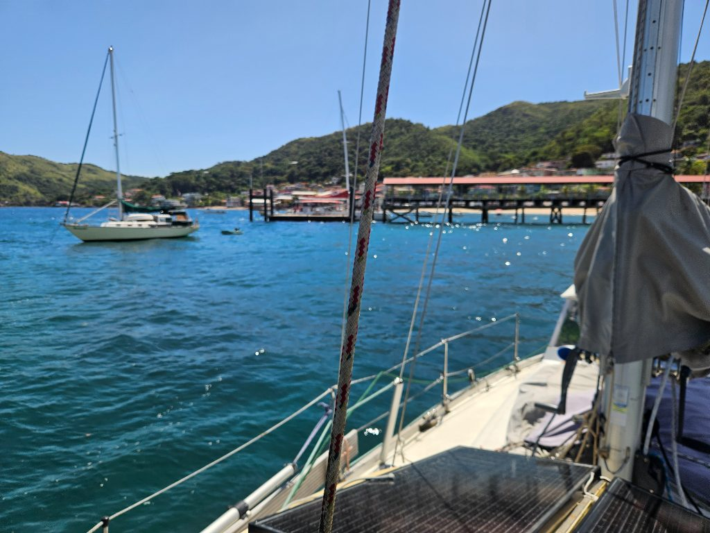
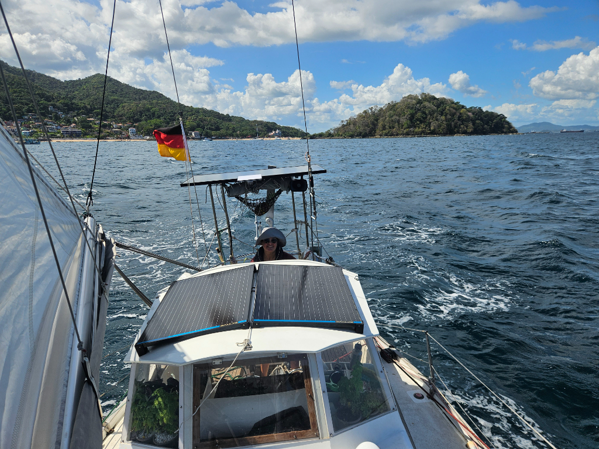
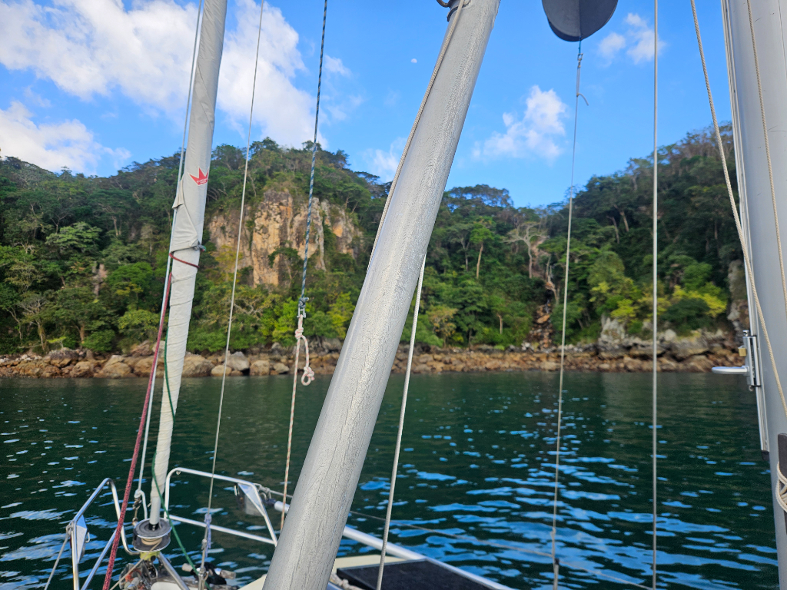

While waiting for various logistics to happen, we decided to go and spend a few days on the outer islands of Panama City. Taboga had been recommended, and so we hoisted the anchor and headed there.

The morning was fickle winds, and so we alternated between ghosting under sail, and motoring. At Taboga the anchorage proved to be very tight - at least if you didn’t want to drop the hook in 20m. We found a small spot between _Katydid_ and the beach.

While doing our normal anchoraging routines, the wind picked up and produced an immediate short and sharp wave pattern. We visited *Katydid* briefly and agreed to look for a better spot.

Anchor up, followed by the sails. Wind was around 12kn, but soon picked up to over 20. Good time to leave! We put in a reef and rounded the corner to the other side of Taboga. This had been recommended by *Breezen*, and indeed what a beautiful spot! The anchorage is quite deep, but well protected from the prevailing wind. Steep hills and a waterfall surround us, somewhat reminiscent of Scotland. But if there was shore life, it'd be crocodiles instead of seals.

* Distance today: 15.8NM
* Lunch: feta salad
* Engine hours: 3.4
