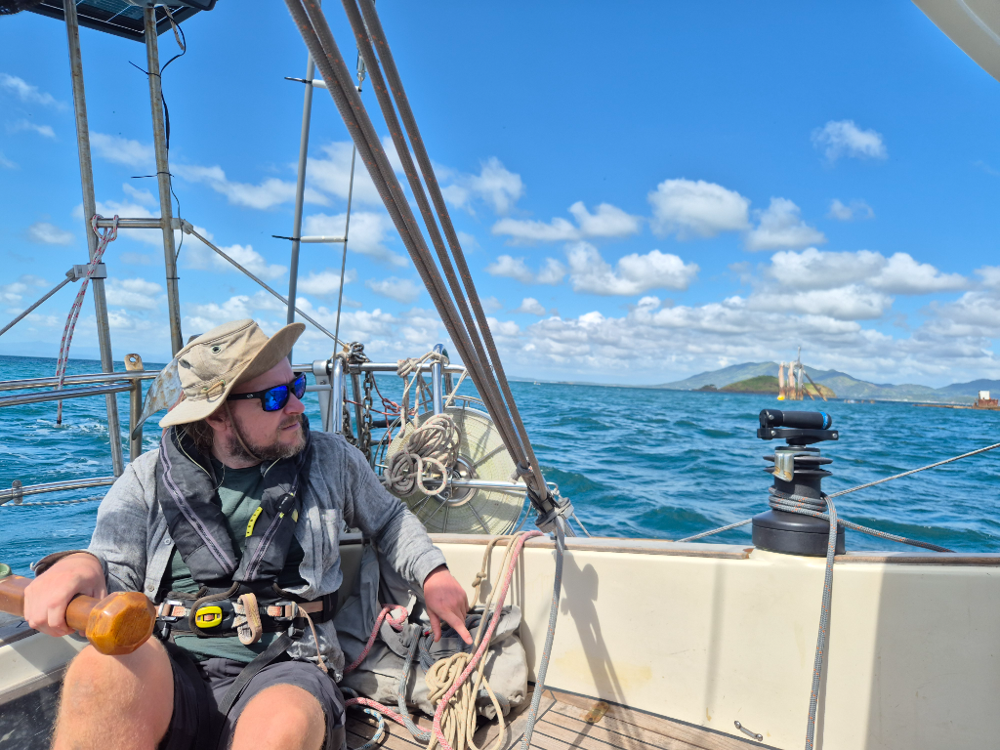
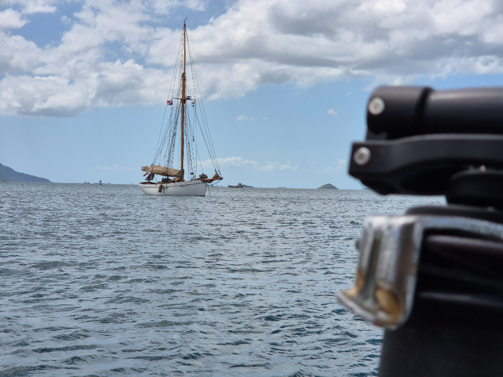

Looking at the weather forecast, we decided that today is the nicest day to sail back. So we hoisted the anchor and set main in first reef and dug out the staysail. 

The waves were splashing accross the bow and Lille Ø heeled deep when we pinched as high to the wind as possible. The current against us we made slow progress towards our anchorage. About 2 miles to the channel, the coast guard came by with blinking lights and ordered us to take the sails down. Apparently one should not sail close to the channel. Our definition of close isn't two miles. But there is no arguing with the officials. So we lowered the sails and motored the last 3 miles.

Now we are again anchored next to _Katydid_ and to our surprise _Tally Ho_, the famous wooden sailboat that won the 1927 Fastnet and was recently rebuilt and is on it's way to race on the 2027 Fastnet.

* Distance today:  11.6NM
* Engine hours: 1.7
