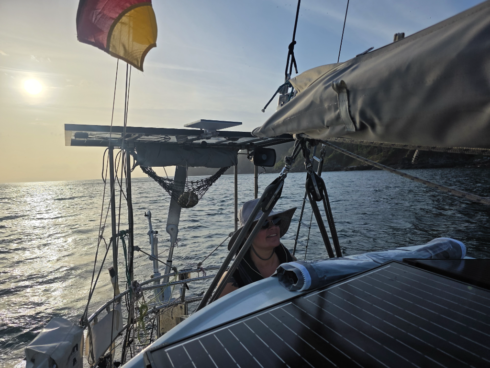
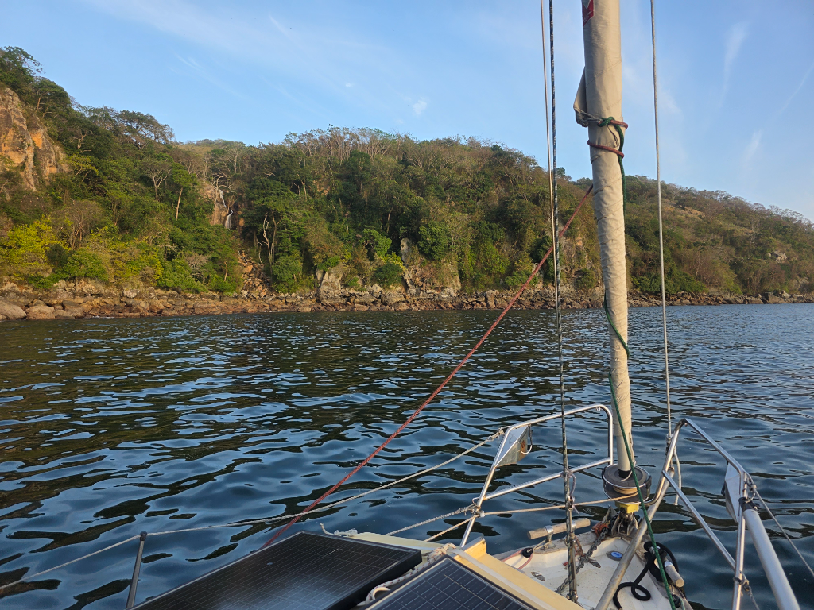

Having spent almost four weeks again anchored off Panama City, it was time to go. Our original intention was mid-February, but fixing a leaking muffler and a broken watermaker took a while. But better to deal with those here than in the middle of the ocean!

We completed the border formalities and some last-minute groceries, and decided to move to Taboga to have a bit more predictable wave conditions for the rig check and bottom cleaning. La Playita is a fine anchorage, but you frequently get big wake from the passing ferries and pilot boats.

Anchor came up surprisingly clean, apart from a thick layer of growth and hundreds of tiny crabs on the chain. Then we proceeded to motor southwest and around the corner of Taboga. The cove was empty when we arrived, and we could choose a good spot. But now we're actually trapped here as the local fishermen laid a net across the entry. Hopefully it'll be gone by morning.

* Distance today: 9.8NM
* Lunch: Burgers
* Engine hours: 2.7
