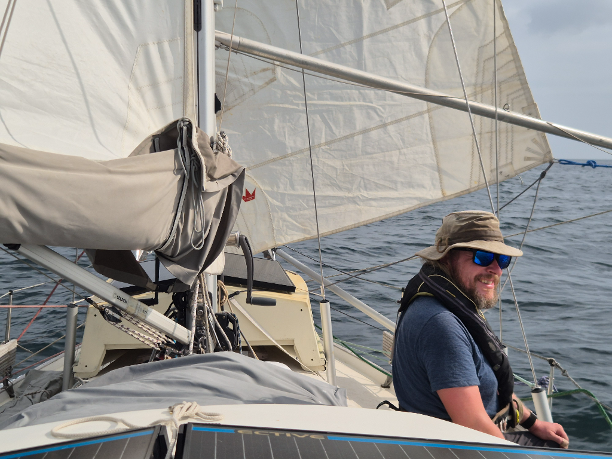

In the afternoon as the wind picked up, we hoisted the anchor. It was time to leave the joys of being close to land behind. We are as ready as we can be. What awaits us promises to be our longest passage. An idea so big that it is hard to fit it to my head. Somehow one corner of it disappears over the horizon no matter how you look at it. Now all we can do is embrace the journey and enjoy the moment.

Mainsail in 1st reef and staysail on we are being shot out of the Gulf of Panama with 6 - 7 knots of speed. The current helping us along. Dolphins greeted us with couple of epic splashes in the distance and now after dinner we are settling to our watch schedule. Life at sea shall find it's pace again.

* Distance today: 16NM
* Lunch: feta salad
* Engine hours: 0.8
