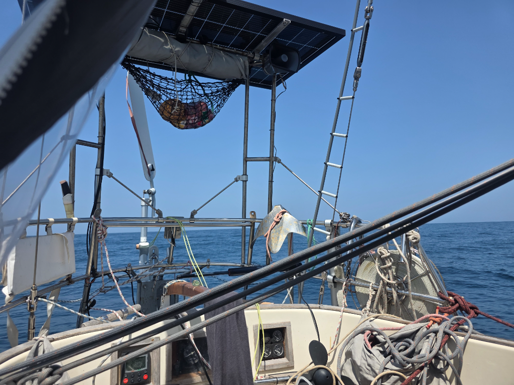

At night we were able to hitch a ride with a powerful current, and so we barreled south at speeds previously unknown on Lille Ø. 9-10kn meant that Panama was soon left behind.

In the evening our hydrogenerator fell off, but Suski was able to fish it back on board. It looks like everything is intact, but it will need to be tested.

The fast and easy ride ended at noon when we hit a calm patch. This where the southwest-setting current became problematic, as we couldn't sail out with the light winds. After a moment of effectively sailing backwards we gave up and let the current drive us. It is still going 4kn into the right direction.

We utilized the calmer seas for reinstalling the hydrogenerator.

* Distance today: 154NM
* Lunch: Spaghetti alio olio
* Engine hours: 0
