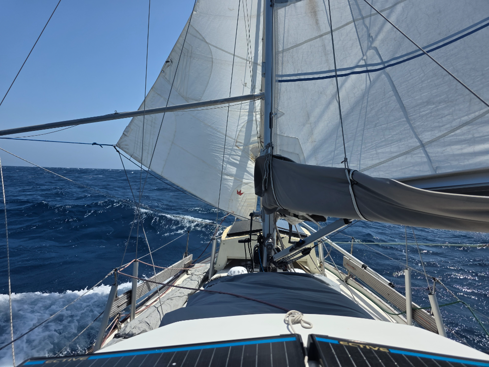

The night brought some light winds and we made good progress aided by the current. At dawn watch change we reefed the mainsail to 2nd reef in preparation for the expected 30kn winds. They came as promised and we enjoyed the speed immensely. A dampener to the feeling came with a debree field of trash, twigs and sizeable logs. Sharp lookout was required in a desperate attempt to avoid hitting the biggest ones. Only once I missed a big one, but the impact was luckily only a soft thud. 

As we are going to the night, the big theme is avoiding the island of Malpelo with enough sea room. The nearly full moon accompanies us on the night watches giving the sea a delightful sparkly surface.

* Distance today: 136NM
* Lunch: lentil-coconut soup
* Engine hours: 0
