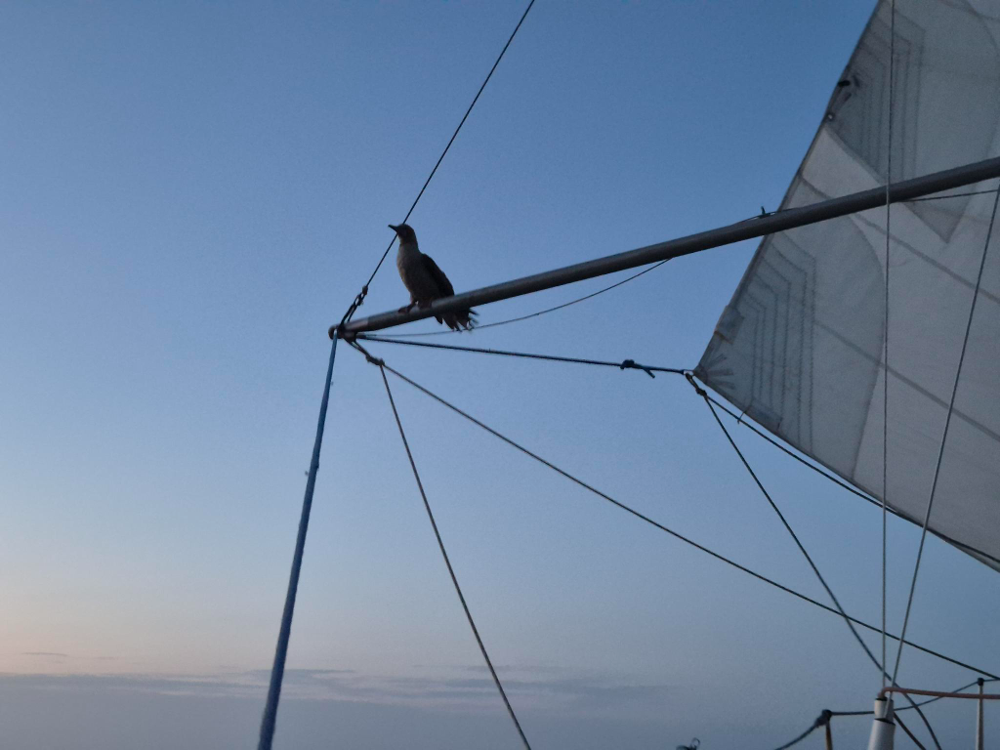

In addition to our primary offshore communications system, Starlink, it is also important to utilize the secondary systems frequently. Now that I have a full amateur radio license, we're able to use the HF radio on board. And so we have now enrolled to the [Pacific Seafarers Net](https://pacseanet.blogspot.com/p/normal-0-false-false-false-en-us-x-none.html?m=1) (14300kHz at 3:00Z). This is a voice-based radio net that tracks boats during their ocean passages.

Last night when reporting in, we were alerted of the lunar eclipse to occur. Since we had cloudless skies, we got to watch the shadow on the moon grow from a small "hat" to a nearly full eclipse. Nice!

A brown booby chose our spinnaker pole as its hotel for the night, staying perched despite the occasionally big rocking in the swell. The bird left at sunrise.

We are starting to get closer to the doldrums, and so winds are getting more fickle. But so far sailing conditions are good, and right now weather routing thinks we should be able to reach the southeastern trade winds with little motoring, as long as we stick closer to Ecuador than Galapagos Islands.

* Distance today: 144NM
* Lunch: beans and rice with fresh herbs
* Engine hours: 0
