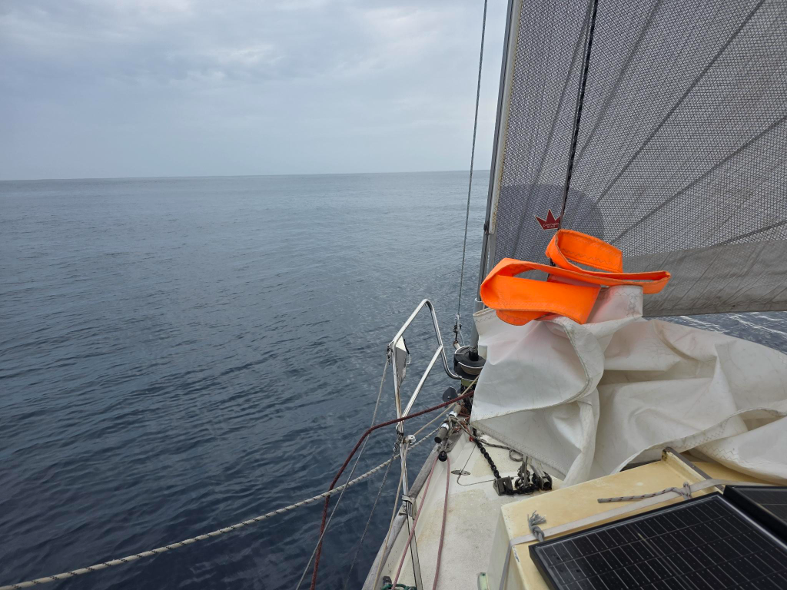

As the night grew older, the wind started to dwindle. The mainsail came down as going down wind it was just making noise and not really helping with speed. We continued with the double headsails. Annoyingly the blue extra sheet is not long enough to run the full genoa when not poled out and Bergie not wanting to wake me up opted to run it reefed. As mid day arrived, the wind had turned even more requiring a new sail plan. The staysail came down, so did the blue rope. Genoa got stretched out and the mainsail was up in full too. 

Light headwinds and only a large rolling long swell means that we are silently sailing further with couple knots of speed. Long distance sailing sometimes is making desisions based on how loud they are versus how effective they are. Silent but slower is always our choice. Good sleep is basis for a successful ocean passage

* Distance today: 65NM
* Lunch: tomato-feta pasta
* Engine hours: 0
