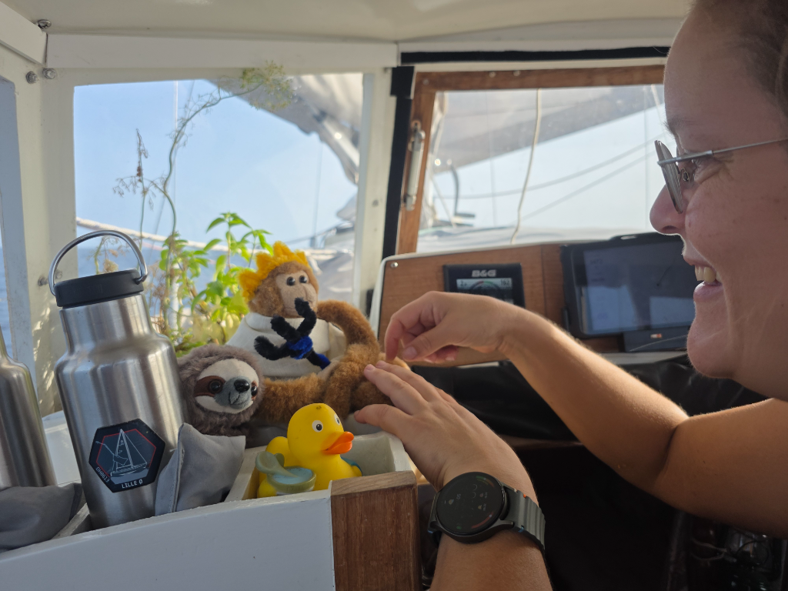

Another slow but comfortable day in the light conditions. We've been mostly carrying full sail and making slow but steady progress south. It makes no sense to turn on the engine this early in the long passage, especially as the boat is still mostly steerable and moving in to the right direction.

At the time of writing, we're still some 17NM north of the Equator. The crew is eagerly waiting for the line crossing ceremony, and King Neptune and his court have already assembled in the cockpit in anticipation.

* Distance today: 70NM
* Lunch: pea soup
* Engine hours: 0
