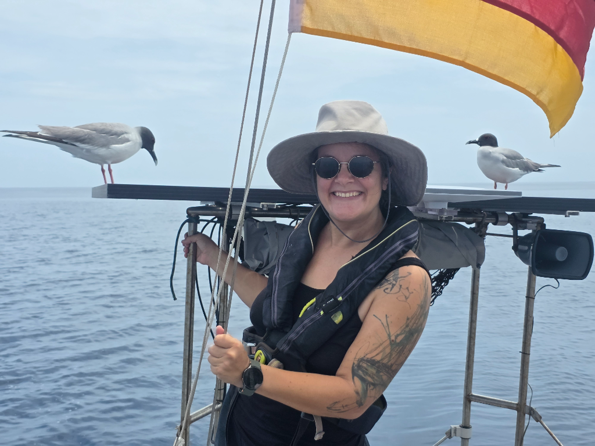
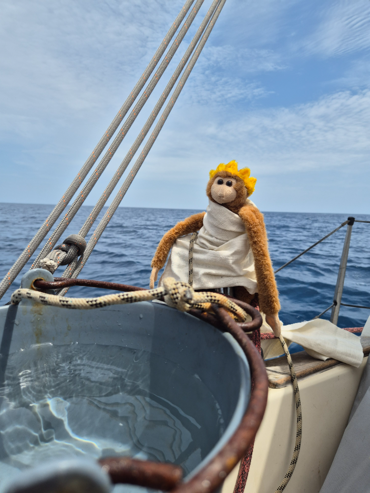
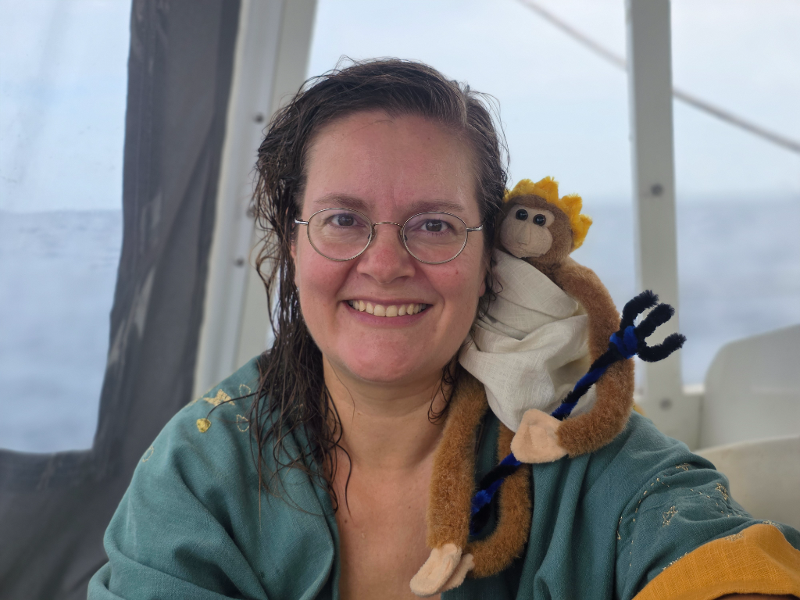

This was our slowest day yet. Wind has been under 5kn for most of the time. At night a frigate bird decided to use the aft solar panel as its sleeping spot. In the morning it left and behind it a very thoroughly pooped panel. The panel got washed, and soon after two swallow-tailed gulls decided that aft panel is the coolest place to hang out. We seem to be popular with the local wildlife.

At noon, with 3 nautical miles to equator, the wind picked up and we were able to hoist the mainsail too. Suski went to bed and was woken up before crossing the equator for the audience with Neptune's court that had assembled for the line crossing ceremony. Neptune raised water from the deep and both Suski and Bergie were doused properly and thusly accepted to Neptune's court as shellbacks.

.jpg)

Now we are sailing further SW in search of the trade winds that are at the moment 5°S, so a few slow days are still in ahead of us.

* Distance today: 46NM
* Lunch: makaronilaatikko
* Engine hours: 0
