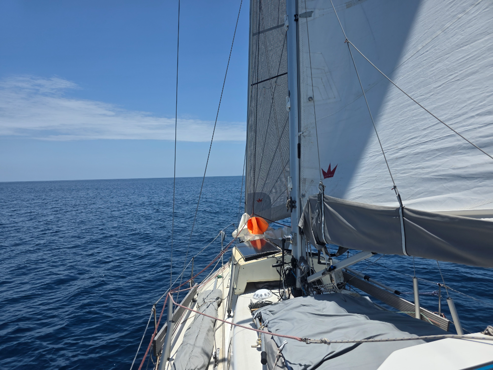

We've been at sea for a week, and the days are starting to blend into a continuous stream of watches. Sleep, sail, sleep, sail.

Conditions remain light and very comfortable as we ghost our way to the southwest. Beam reach, and the boat just glides on the blue ocean. We had two brief visits from dolphins at night and in the morning.

* Distance today: 63NM
* Lunch: shiitake mushrooms with fried egg rice
* Engine hours: 0
