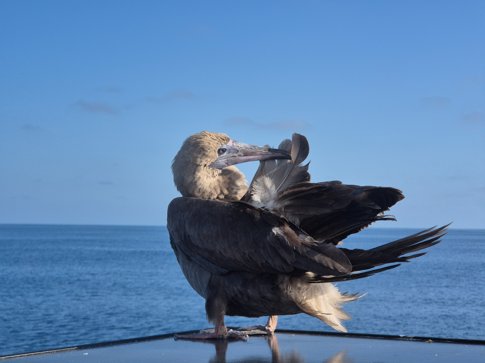

The night was windless. At first we were slowly sailing. By the midnight watch change, the wind died completely. As we both were awake, we decided that it was time for some motor maintenance aka motoring time. We have decided to run the motor for an hour or so every week to keep it happy on the long passage. 

After the 1.5 hours of motoring Lille Ø slowly drifted towards NW. At dawn the wind picked up to 4kn, which ment that we could again choose the direction we were going, not the current. As the night draws closer, we are enjoying 6kn of wind, which at this point feels like a lot! 

The bird of the day was a brown booby sitting at the aft solar panel.

* Distance today: 45NM
* Lunch: cous cous salad
* Engine hours: 1.5
