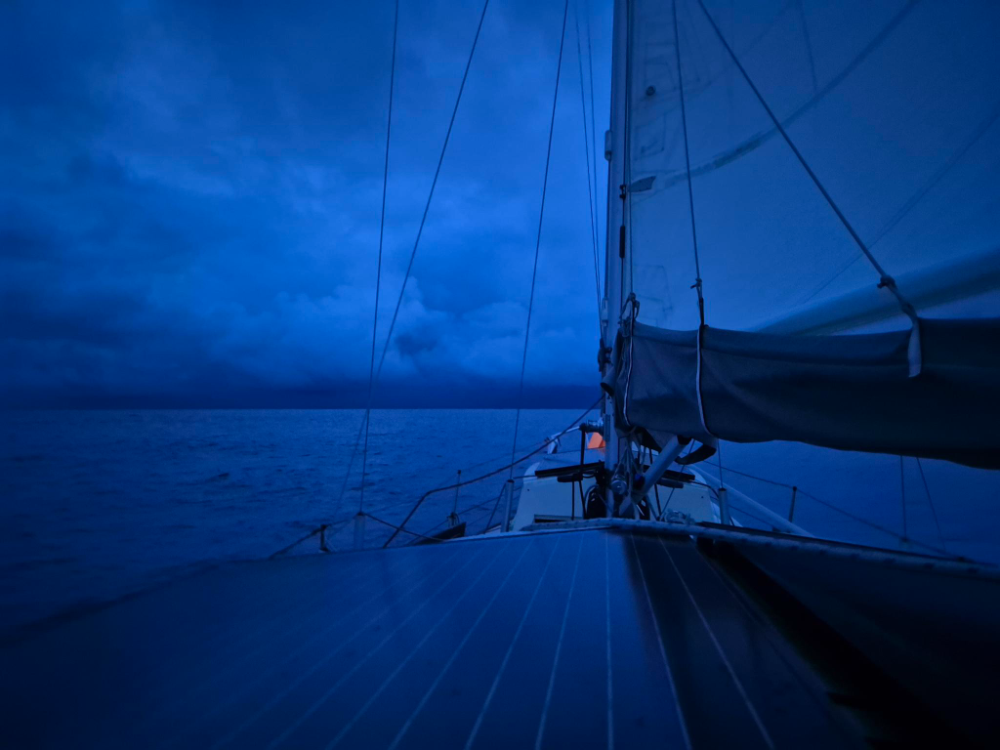

We finally hit the proper convergence zone, and so the night went with fickle winds, heavy rain, and some thunder in the distance.

What a difference the hard dodger and the new backdrop make in these conditions! One could sit on watch outside, and stay perfectly dry!

By midmorning the sky cleared, and we could actually enjoy some sailing with the wind on the beam. Now approaching dinner time we reached the next calm patch, and this time we decided to punch through it under engine power.

* Distance today: 50NM
* Lunch: chanterelle risotto
* Engine hours: 1.5
