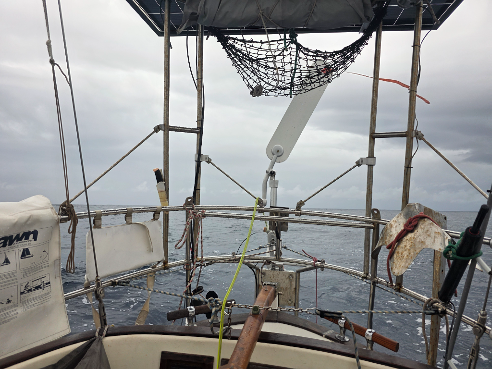

As the night fell, we motored on hoping for wind. In the early hours of morning it came, suddenly and fast. 20kn out of the darkness. So we rolled out a sliver of genoa and sailed! Since then the wind keeps disappearing and reappearing randomly. The sky is grey and the seas confused. So to keep up the morale, we motor the in betweens because drifting would be just too umcomfortable. Neither of us is sleeping well with the constant changes in conditions. At least we are making solid progress now.

Quite a huge difference with the forecast, where it was supposed to be sunny with light but consistent wind.

* Distance today: 105NM
* Lunch: Shakshuka
* Engine hours: 12.4
