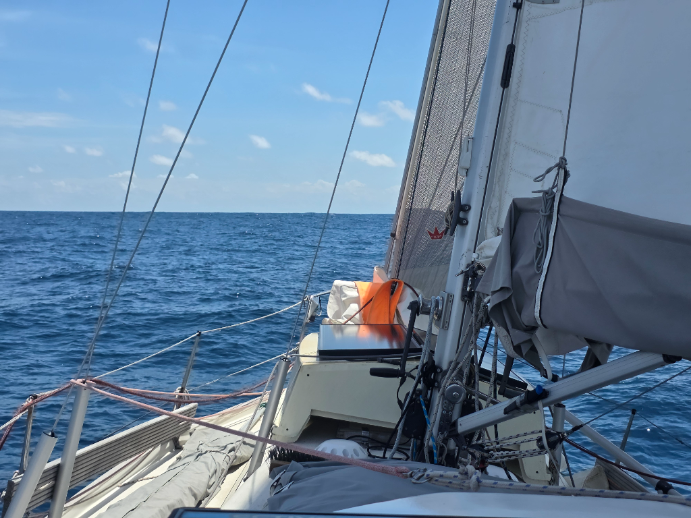

What a difference a day makes! Around 8pm we caught an easterly breeze and could stop motoring, and around midnight the wind was strong enough for the windvane to steer.

Night was cloudless, and the only challenge was a trawler that crossed our bow, the long trawl lit like a string of Christmas lights.

The lovely conditions continued throughout the day, and we've been able to enjoy leisurely ocean sailing on a beam reach without having to touch a single line. These are not yet the trade winds, but it feels we're on the trail to find them.

In the morning, Suski caught a tuna, providing us with some new variation in the menu.

* Distance today: 88NM
* Lunch: tuna ginger curry
* Engine hours: 1.6
