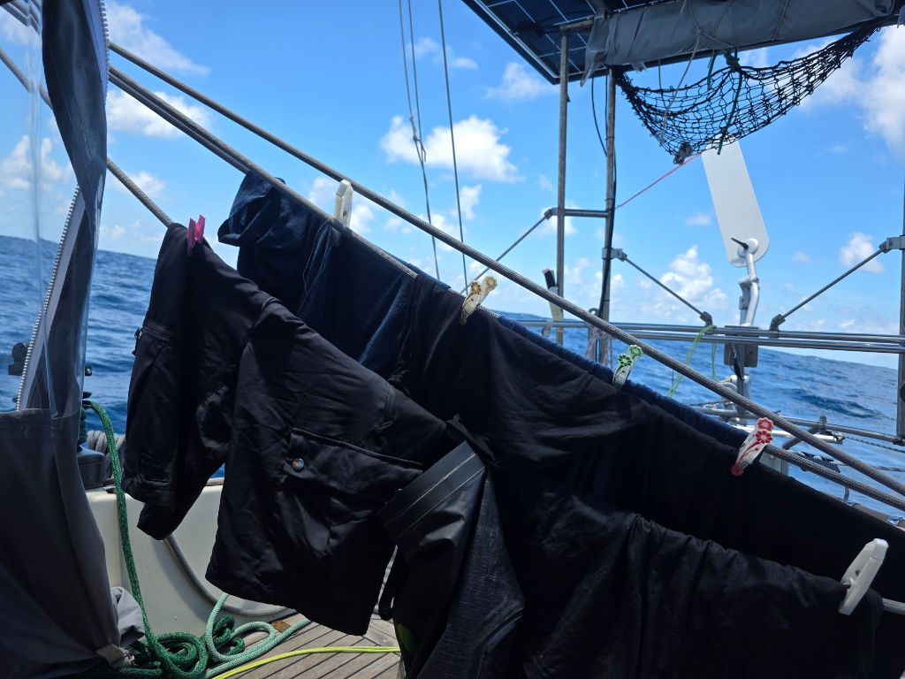

The wind has kept constant for the past 24 hours. Only small puffly clouds spot the sky, so the batteries are full at 2pm. We run the watermaker every day and we keep the tank  full. Excess water is then used for fresh water showers or like today, for laundry. We aim to be somewhat civilized so that other boats first see us, not smell us. 

As the calms are now hopefully behind us, the birds have stopped visiting. They still try to land on the aft panel, but at this speed, the runway is too short and the landings are unsuccesful. At night the swallow tailed gulls hunt around the boat making their gurgling sounds and the white fluttering shapes keep disappearing and reappering from the darkness. 

* Distance today: 82NM
* Lunch: pea soup
* Engine hours: 0
