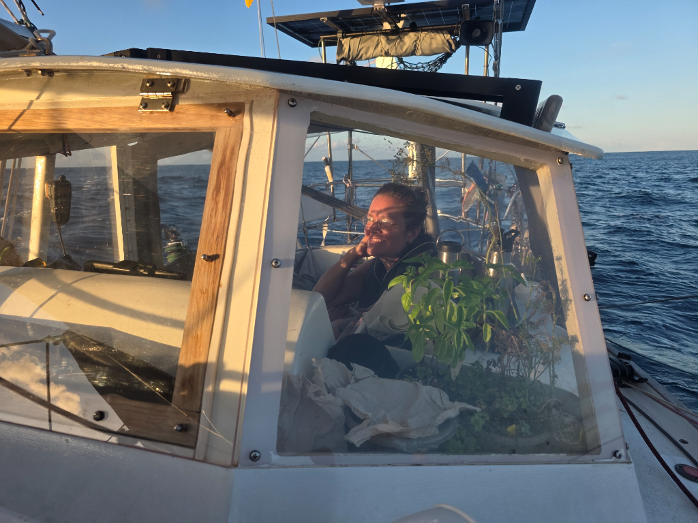

Overnight the winds kept picking up, and by morning we finally found the trade winds around 5°S. At 5°30 we caught a favourable current, and turned our bow towards Marquesas. Now it theoretically should be sailing in a straight line for the remaining 2900NM.

With new moon approaching, the nights are starting to be quite dark. But at least this affords us a nice view of the Milky Way.

* Distance today: 120NM
* Lunch: spaghetti bolognese
* Engine hours: 0
