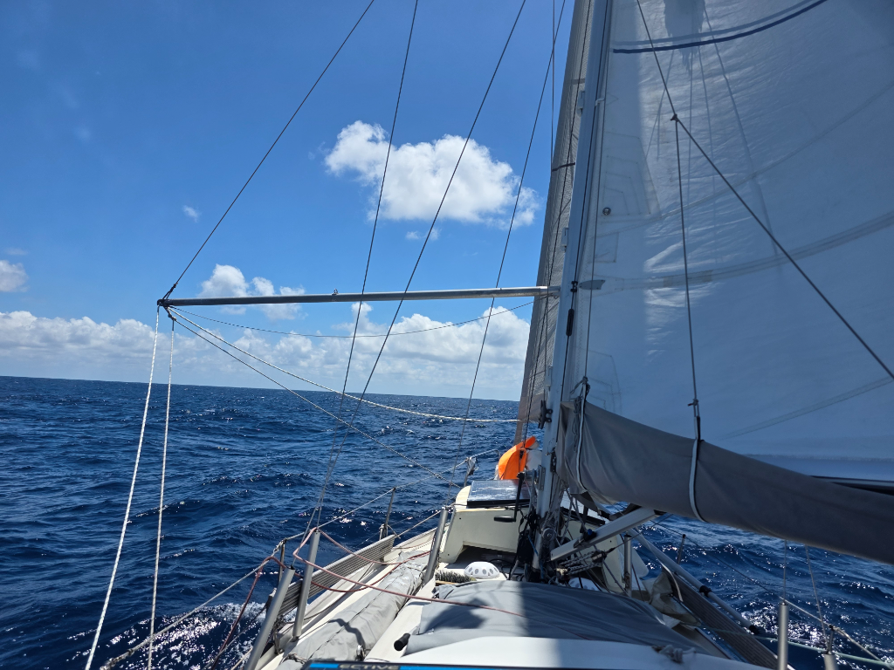

Life in the trade winds is different. We are not so frantically looking at the weather anymore, a single checkup a day seems to provide all the information we need. The boat moves more as the waves come taller and closer together. Moving inside has become a task of planning 3 points of contact at all times, which is easy enough in a small boat. Cooking and doing the dishes has become task requiring skills in acrobatics too. Sleeping is an action of wedging yourself tightly in with pillows, so you don't roll around but get a good night sleep.  Skills we haven't needed in a while. The boat sails itself beautifully, the humans inside need to adjust a bit more. Now, at least, we have time to do that!

* Distance today: 128NM
* Lunch: navy bean soup
* Engine hours: 0
