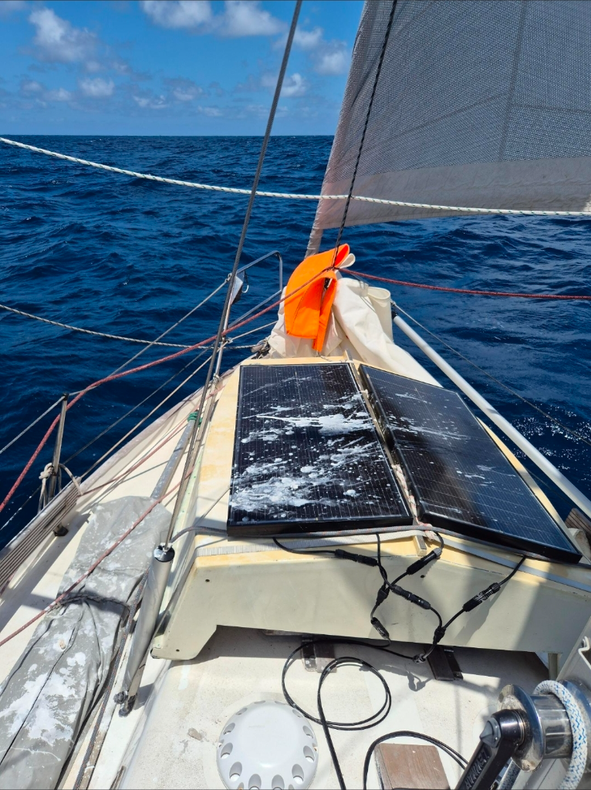

Winds have been remarkably consistent, and so the boat has been mostly left to its own devices, sailing us towards Polynesia. The slight downward trend in wind speeds means that we're now flying full sail.

As right now we rely 100% on solar for our power, the constant battle is keeping the panels clear. Our nightly visitors have a tendency to leave gifts.

* Distance today: 116NM
* Lunch: tofu curry
* Engine hours: 0
