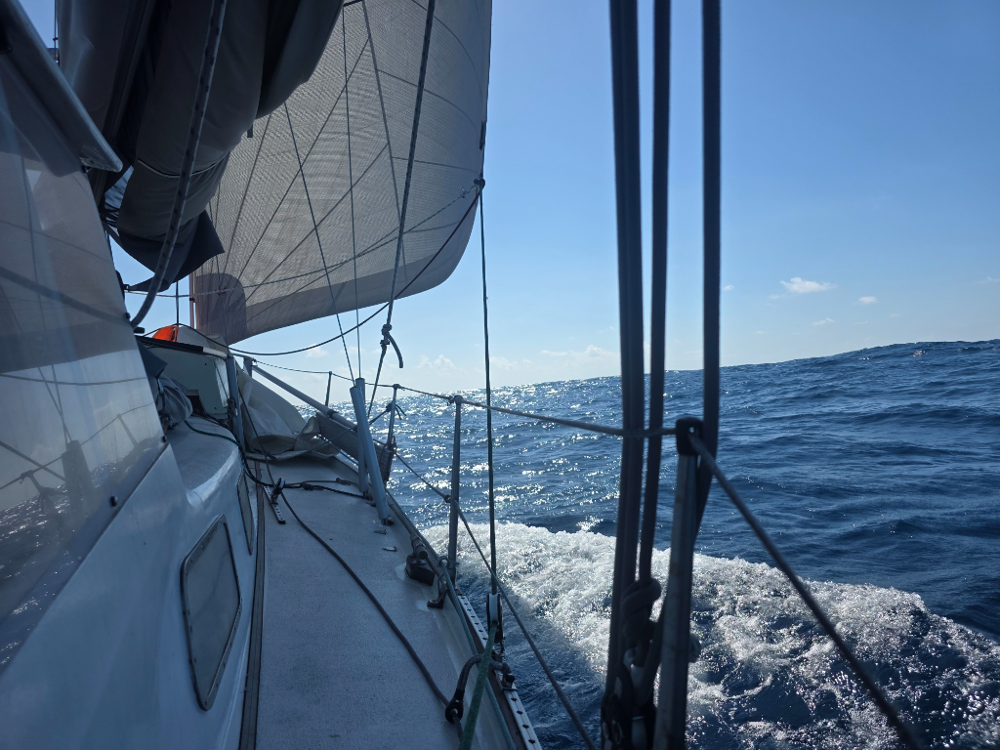

In the darkness a larger cloud started to cover a quarter of the stars, so a reef was put in to the main and genoa was rolled in a bit. Nothing came out of the cloud, so at the dawn watch change, the solar panel in the bow was cleaned and the reef was shaken. By midmorning, we had a slight wind shift and went from wing on wing to port tack. 

Life in the trades has found its groove. The days are blending into each other. Life happens in 6 hour bursts and we socialize with each other and the world at dinner time. At this point messages from friends on land or at sea are very important to feel connected. It makes our 'Little Island' feel still part of the world and we as a part of the life of our friends. 

* Distance today: 101NM
* Lunch: spagetti aglio e olio
* Engine hours: 0
