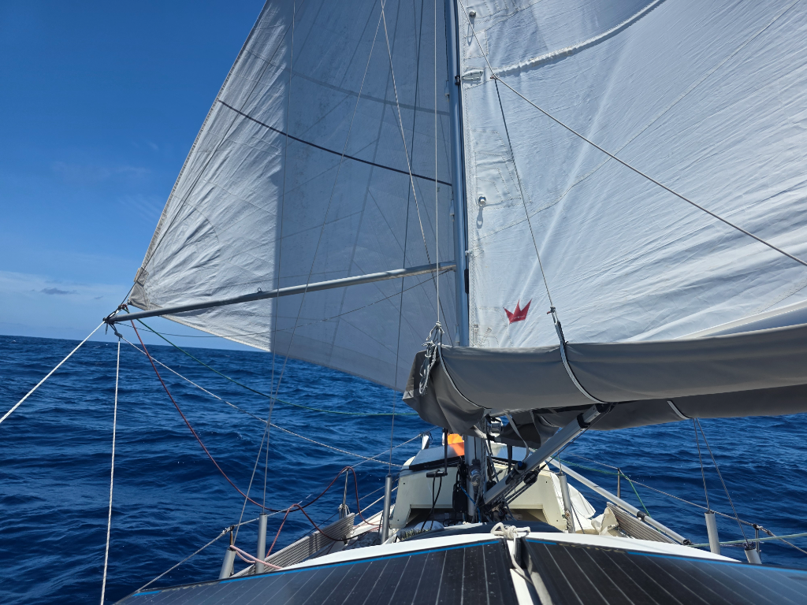

The night passed comfortably with easy conditions and some shooting stars. The last thin sliver of moon rose only an hour before sunrise.

In the morning we were surprised by a clear sky squall, wind shooting from 12kn to 25kn in seconds. We put in a reef, and half an hour later wind had dropped again.

The light conditions mean somewhat slow progress, but at least to the right direction and without undue stress.

* Distance today: 99NM
* Lunch: lentil coconut curry
* Engine hours: 0
