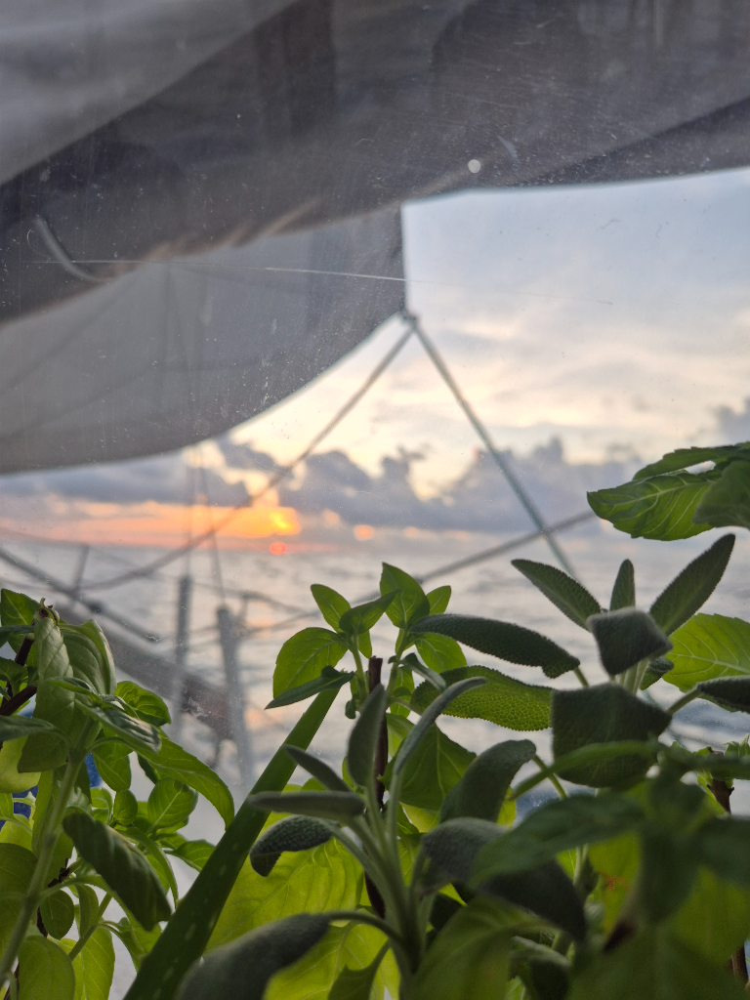

In the light winds we decided to head a couple of degrees more south. So we trimmed the sails to a beam reach and glided along the swell silently. In the cloudless dark night sky you can see the Milky Way very clearly. Orion high in the sky and big dipper is hanging wrong way around pointing to a star not visible anymore.

We got to add ship #11 to the list of boats seen. Now we both are out of the guessing game. We have seen more boats than either of us anticipated.  Progress is slow and the only fresh stuff we have left is onions, garlic and a few limes. And the kitchen garden. Fresh herbs in the middle of an ocean is such a luxury.

* Distance today: 80NM
* Lunch: spinach-mushroom quiche
* Engine hours: 0
