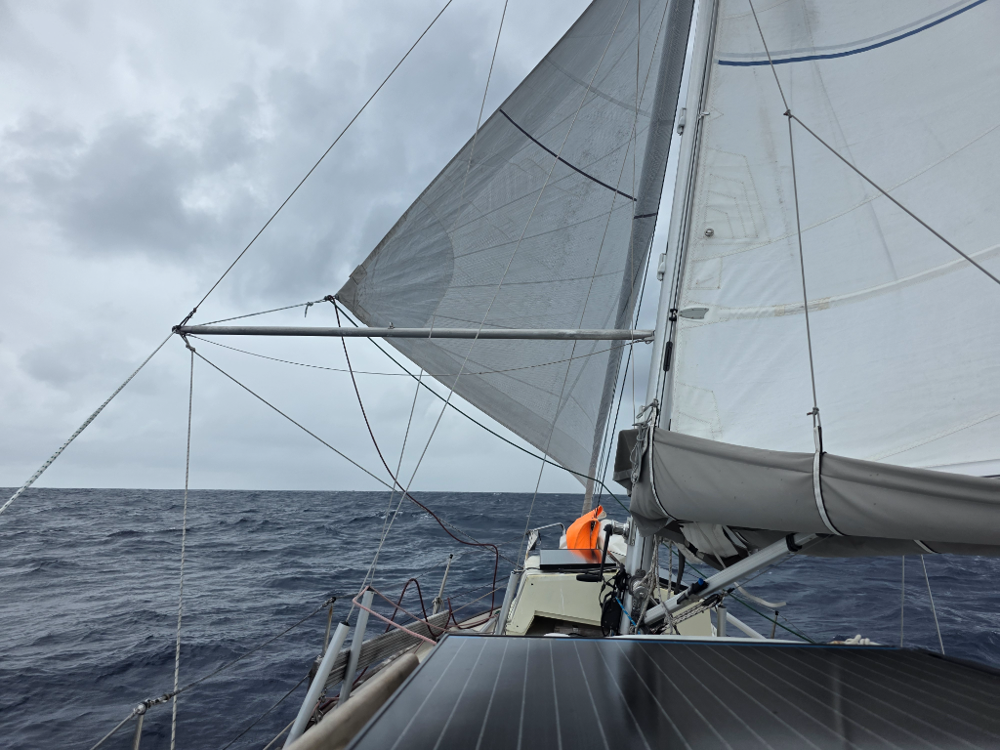

The night was again a smooth magic carpet ride under the starlit sky. But at dawn things became grey and wind picked up. We tucked in a reef. At 7°30 we made the turn west, wing on wing. This latitude should keep us below worst of the squally weather.

We've been wondering about the low daily miles, and today we found the culprit: we have quite a farm of gooseneck barnacles on the hull. This means a bit longer passage time until we can clear the hull in Marquesas.

To take our mind off the grey weather, we decided on a movie night before dinner. Moana was good introduction to the southern Pacific.

* Distance today: 104NM
* Lunch: pea soup
* Engine hours: 0
