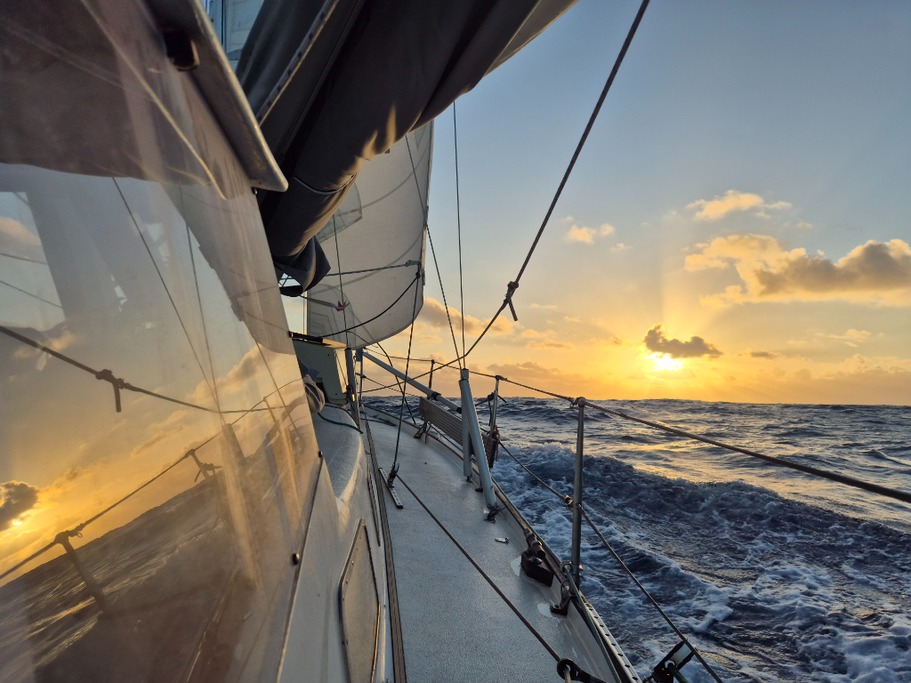

The night fell under starless sky. The clouds hanging low and occasionally we where greeted by drizzle. With no sense of where the sea ends and sky begins, the flying fish were taking wrong turns on a constant rate. Few of them even landed in the cockpit. As the night grew longer, every now and the clouds would scatter revealing the starry night sky.

Main still in first reef and staysail on we greeted the sun and kept barreling up and down the waves. Wind has been shifting every few hours by 50ish degrees, so the seas are lumpy. Lille Ø bounces up and down, side to side. The hunt for things that haven't yet settled to their spot is a sport to keep us occupied. And finding deep sleep in a bed not stable, a skill to be cherished.

* Distance today: 112NM
* Lunch: feta-pasta
* Engine hours: 0
