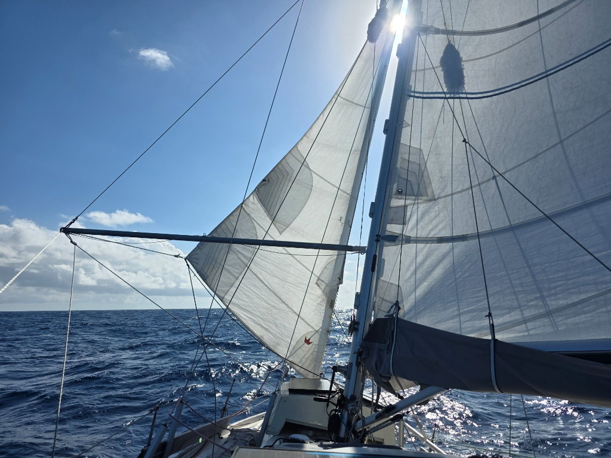

After consulting the weather forecast, we decided to take another degree to the south to avoid a few squally, rainy, grey days. So far this strategy has succeeded, with zero drops of rain instead of the downpour that we would've gotten.

The dark nights of the new moon continue. On today's walkaround check we found and ejected 15 flying fish and 2 squid from the deck and the scuppers.

At 8°30S we turned again west. As solar production has been good, we made some extra water and did a round of laundry.

We've been under way for three weeks now.

* Distance today: 106NM
* Lunch: chanterelle risotto
* Engine hours: 0
