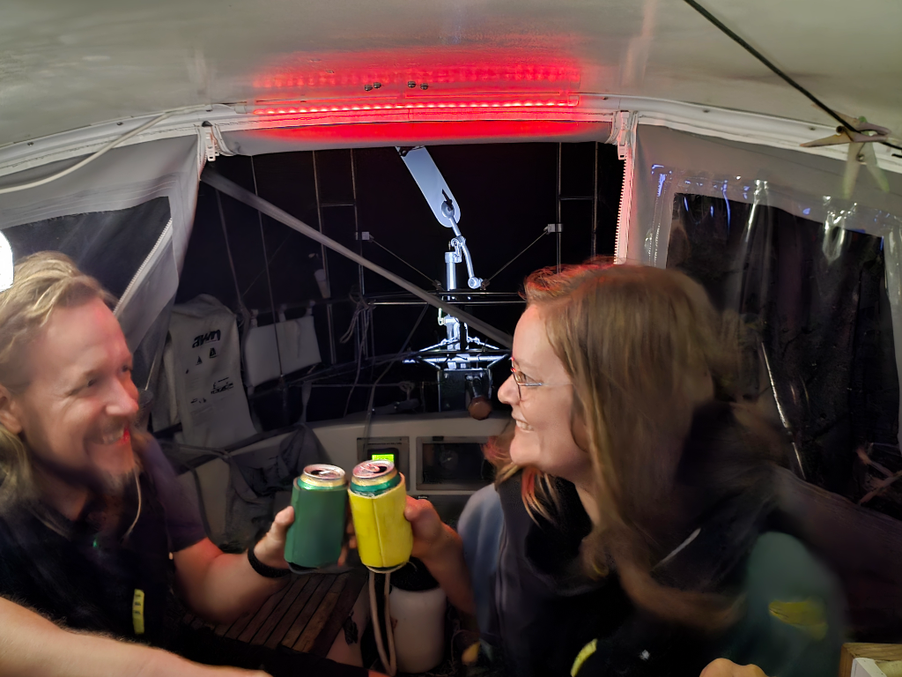

In the dead of the night, we reached a big milestone: The half way mark of this journey. 2060 nautical miles both behind and before us. A point in any journey that brings a change. You are no longer going deeper into the voyage, you are easing off.  It feels like we are emerging from the darkness together with the moon, which now in it's crescent form lingers in the evening sky for an hour longer every day.  

The day is grey and we are being pushed by the wind at varying speeds. The gusts come in at times still warranting the first reef and staysail, at times more sail would be necessary but as ocean sailors, we prefer the safer option. So we sail onwards, there is only miles worth to cross the Atlantic with left!

* Distance today: 94NM
* Lunch: pizza
* Engine hours: 0
