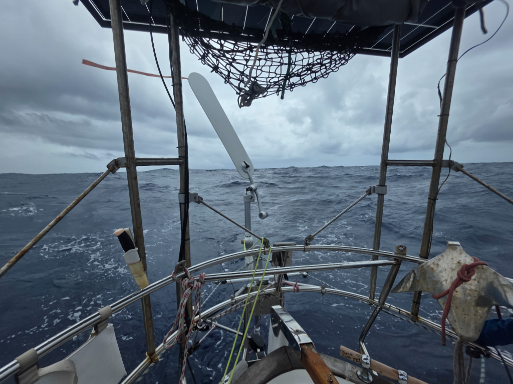

In the evening the grey skies fulfilled their promise, and the first squall hit us. 90° wind shift and gusting to 30kn, we had to do some manouvering to get back on course.

Then a night of clear skies and light winds, followed by a morning full of squalls. All of this means we've been running a meandering course, in between wallowing in lumpy seas with slatting sails.

Not conditions helping a good sleep or a good daily mileage. But onwards we go.

* Distance today: 87NM
* Lunch: lentil coconut curry
* Engine hours: 0
