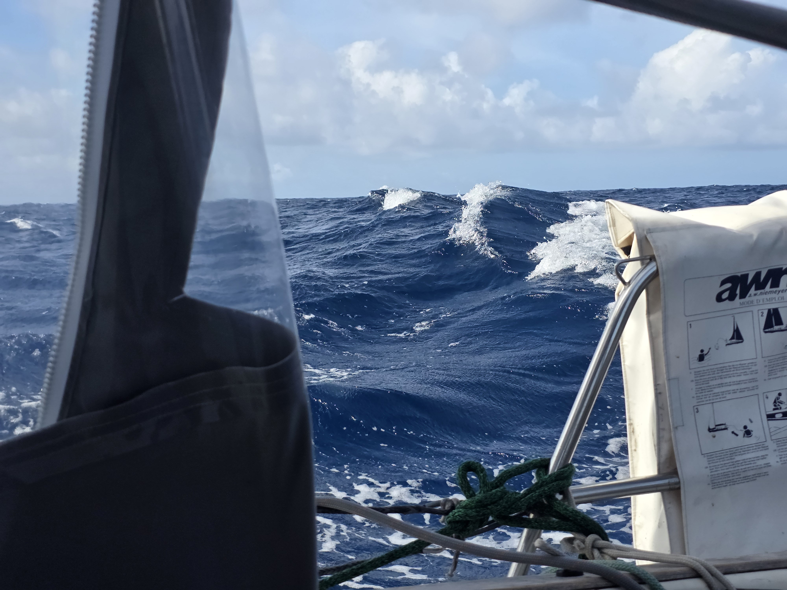

The clouds slowly dissipated during the night revealing the stars. With the clouds gone, the wind also stabilized itself and Lille Ø was again in full control. The dawn rose with only small puffy clouds in the sky, so our solar panels had work cut out for them filling the batteries after couple of grey days.

The wind has been staying at 15 to 20 knots and from a constant direction. The swell is still big, but we have managed to start cutting the first half of the passage into a video. It is nice to be able to introspect the beginning of the journey while still on it.

* Distance today: 106NM
* Lunch: spaghetti aglio e olio
* Engine hours: 0
