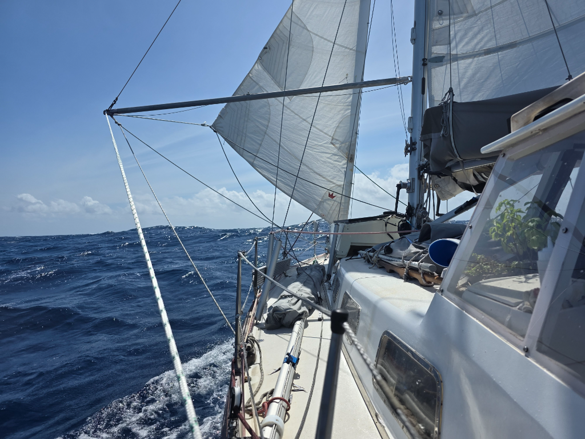

After dinner we had some rain, but otherwise the conditions have remained the same as yesterday, puffy clouds and wind in the low 20s. Lumpy seas.

At night we almost got our 13th vessel spotting. A Japanese fishing boat stayed just below the horizon, only visible by a slight glow in the sky. And of course AIS. Feels we're pretty far when the fishermen are from Japan!

In morning Suski saw a tropicbird circling the boat. These long-tailed birds we haven't seen since our Atlantic crossing.

* Distance today: 115NM
* Lunch: peanut butter lentils
* Engine hours: 0
