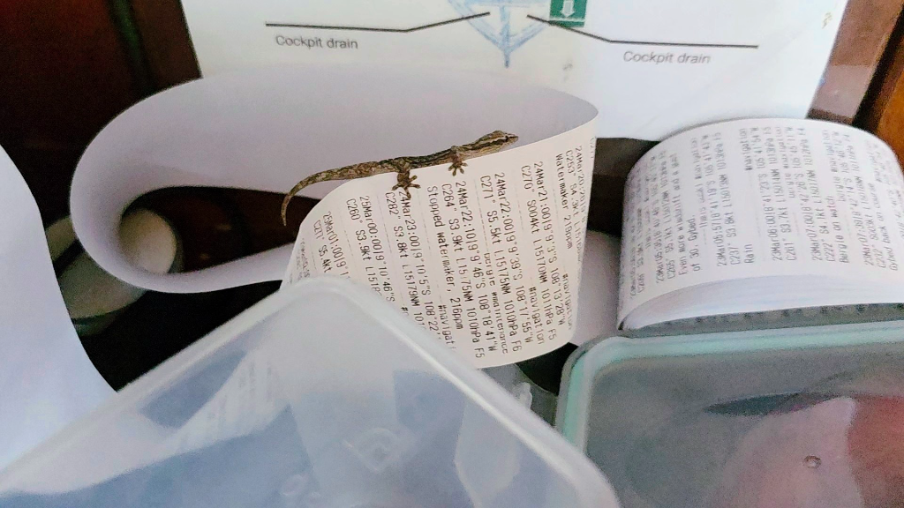

The half moon illuminates the ocean pleasantly. No more second guessing where the sea ends and sky begins. The separation of the two halves is now visible again. In the cloudless night the wind kept picking up, so at midnight watch change we put the main in second reef. That led to the inevitable decrease in the wind speed also. Well, at least the ride was more comfortable now. 

During the day we did some important snack maintenance and dug into the long time storages to get more watch cookies and sweets. 

* Distance today: 113NM
* Lunch: pea soup
* Engine hours: 0
