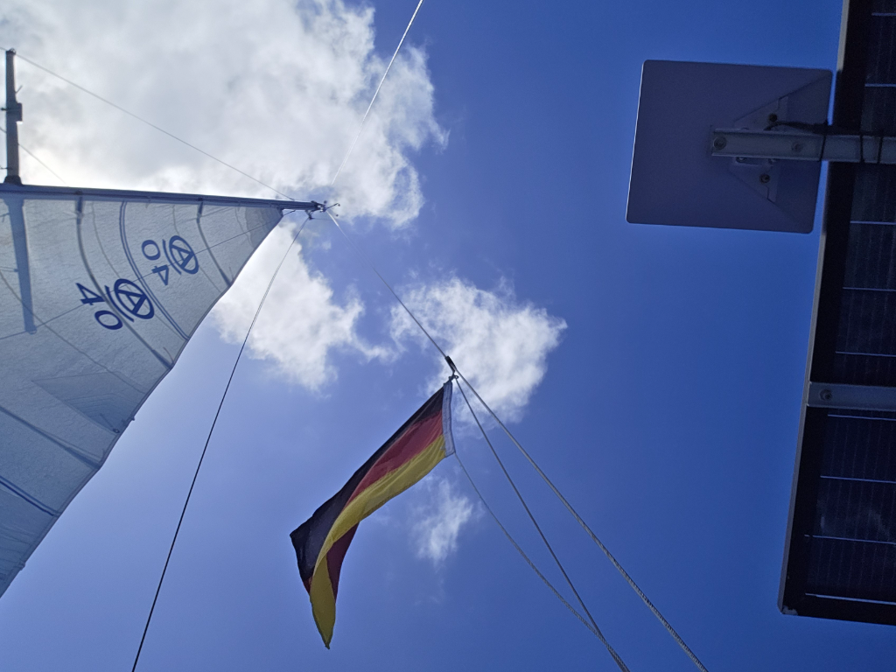

High winds and a bumpy ride continued throughout the night. Sky was mostly clear, and progress was good. At noon winds had subsided a bit, and we shook out the reef.

In the morning we noticed that the starboard deck drain was leaking, right into the main electrical cabinet (great design, Amigo). Caulking was applied.

* Distance today: 108NM
* Lunch: spaghetti with tomato sauce
* Engine hours: 0
