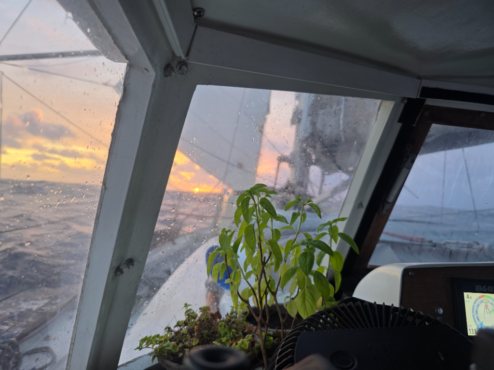

The night fell in the same conditions, wind around 20 knots from a steady direction. Lille Ø sails itself beautifully on first reef and staysail. 

The big event of the day was changing to UTC-8. Only 1.5 hours till Marquesas and UTC-9.30! We have now been at sea for a month, and have done three time zone changes during that.

* Distance today: 120NM
* Lunch: mushroom risotto
* Engine hours: 0
