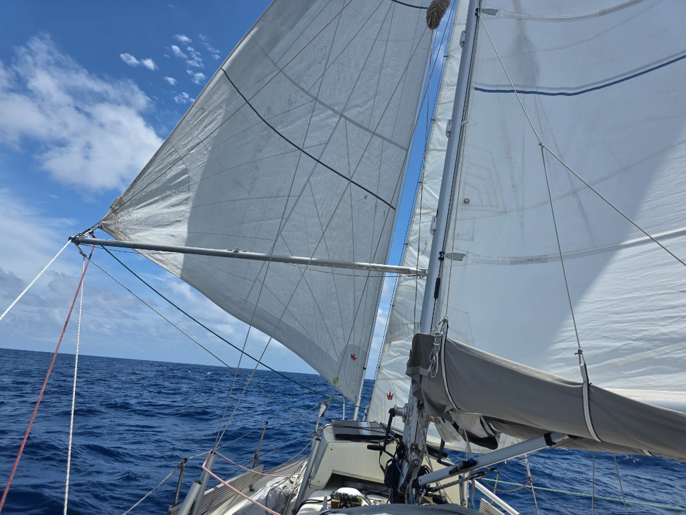

This weekend the HF radio net has worked quite poorly due to interference from an amateur radio contest on a nearby frequency. Hopefully radio conditions clear up.

The wind has been remarkably steady for days now, but in the morning it dropped a bit. To keep the boat moving comfortably, we rolled out the genoa at noon. This means that we now are flying a three-sail setup: main, poled out genoa, and staysail to the lee. The staysail helps with the rolling, and means we can go back to heavy weather setup quickly by just furling the genoa.

* Distance today: 111NM
* Lunch: navy bean soup
* Engine hours: 0
