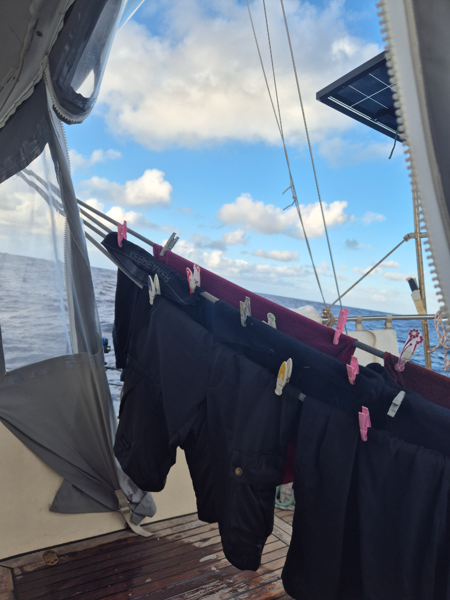

By 10pm the wind had picked up enough for a change back to staysail. The moon lights the sea even in cloudy conditions and the dark grey sea creates a calming backdrop for the watches. At around 10am the wind dropped and we changed back to genoa, staysail and main in 1st reef setup. 

The watermaker ran today for laundry purposes: a set of clothes for the next week got washed and hung to pre-dry on the mainsheet before being moved to dry inside for the night. Life at trade winds is a repetitive task only punctuated with occasional sail changes.

* Distance today: 115NM
* Lunch: tofu curry
* Engine hours: 0
