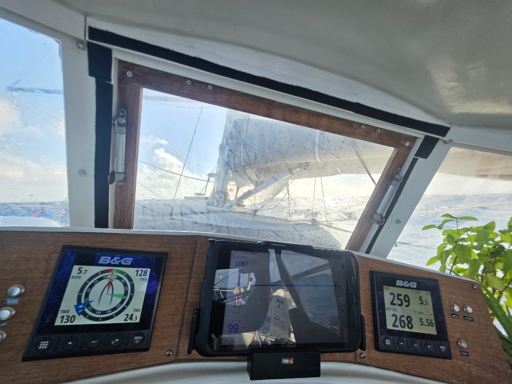

The latest GRIB changed the forecast quite a bit, and we now have couple of days with stronger wind ahead of us. In anticipation to that, we rolled the genoa away for the night watches.

Unlike forecasted, the wind only picked up around midday. But at least we were ready for it, with staysail and main in 1st reef, and well-slept free watches of the night behind us.

Today's wind has a slight southern component, meaning that we're now on port tack instead of poled out.

* Distance today: 100NM
* Lunch: lentil soup
* Engine hours: 0
