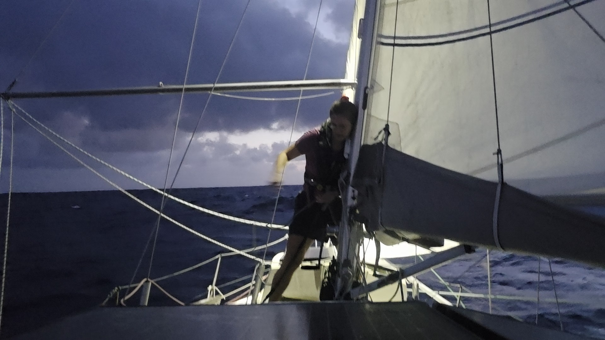

At sunset a gust came through incentivising us to go to second reef. After that was set, we also went back to wing on wing. The southerly component in the wind was gone. The night was boisterous with wind gusting up to thirty. The second reef had indeed earned its setting. We also made good miles and at dawn we saw it. 999NM to destination. Mere 3 digits! Numbers so small that we had started to doubt their existence.

As the day grew older, we were at the edge of grey and blue skies. We took the staysail to starboard side and sailed slightly more to the south to secure our spot in the sun.

* Distance today: 114NM
* Lunch: chana masala
* Engine hours: 0
