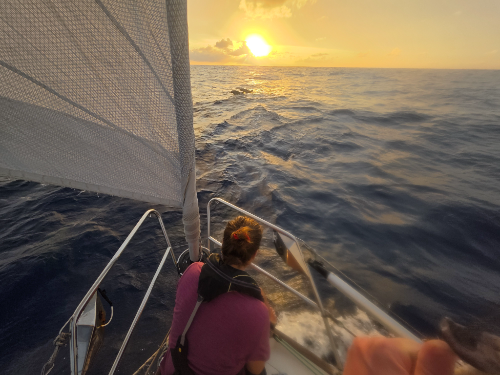

In the morning we saw a sail in the horizon. *Mastegot* was the 15th vessel we've seen on this passage, but the first sailboat. We had a brief VHF conversation, and learned that our AIS wasn't transmitting.

Some investigation later, it turned out the problem was that the transceiver didn't have a GPS fix. Moving the antenna outside helped, but it is curious for this problem to occur now, as the particular antenna has worked fine in its original location since 2021.

At noon wind dropped substantially, so we shook the reef and rolled out the genoa. Now we're back to the three-sail setup.

Right as we were finishing dinner, a large pod of dolphins arrived to play in our bow wave.

* Distance today: 107NM
* Lunch: pea soup
* Engine hours: 0
