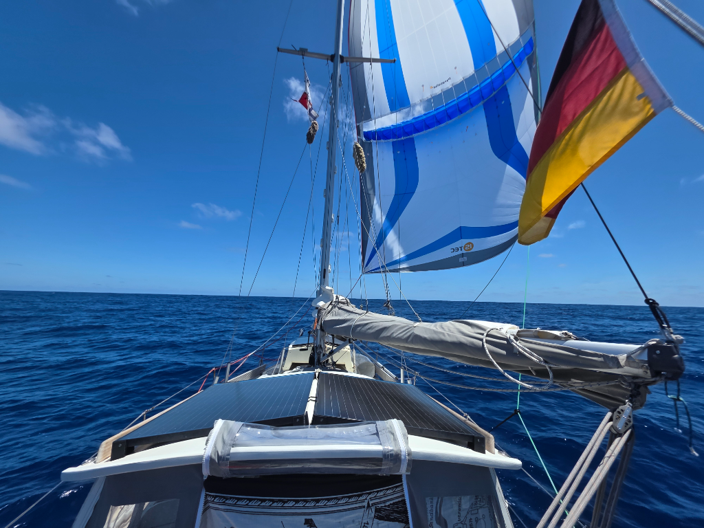

The wind kept dropping throughout the night. At midnight we packed away the mainsail to keep it from slatting. And then at sunrise the Parasailor came up.

As always, this big sail with its built-in wing stabilises the boat, as well as making it possible to sail in lighter winds than otherwise possible. Outside of the doldrums this passage has been surprisingly windy, meaning that until now it hasn't made sense to deploy the Parasailor.

While today's mileage has been low, that additional stability made for better sleep, as well as more elaborate cooking. We enjoyed some stovetop pizza followed up by cinnamon rolls.

* Distance today: 79NM
* Lunch: pizza
* Engine hours: 0
