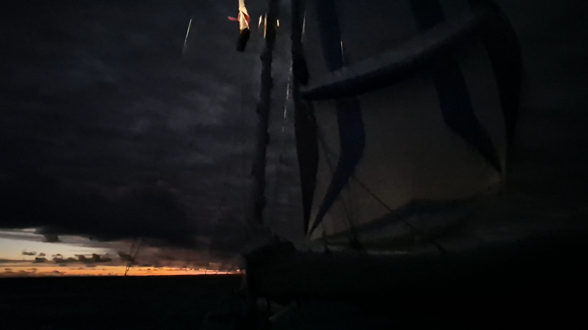

We sailed into the night with the Parasailor up. A bold move for sure. With the moon and the motor light on, the sail is fully illuminated and easy to control. Just after 23 the wind started picking up. At 23:20 a gust of 17kn was enough to prompt a early wakeup call for the off-watch, and we packed the Parasailor up and went back to wing on wing.

Since the sail change the day has been a steady progress towards our destination and the rest of the cinnamon rolls have been eaten as watch snacks. Life at sea is sweet at the moment! 

Cheers Petra and Uli!

* Distance today: 98NM
* Lunch: cashew-tomato pasta
* Engine hours: 0
