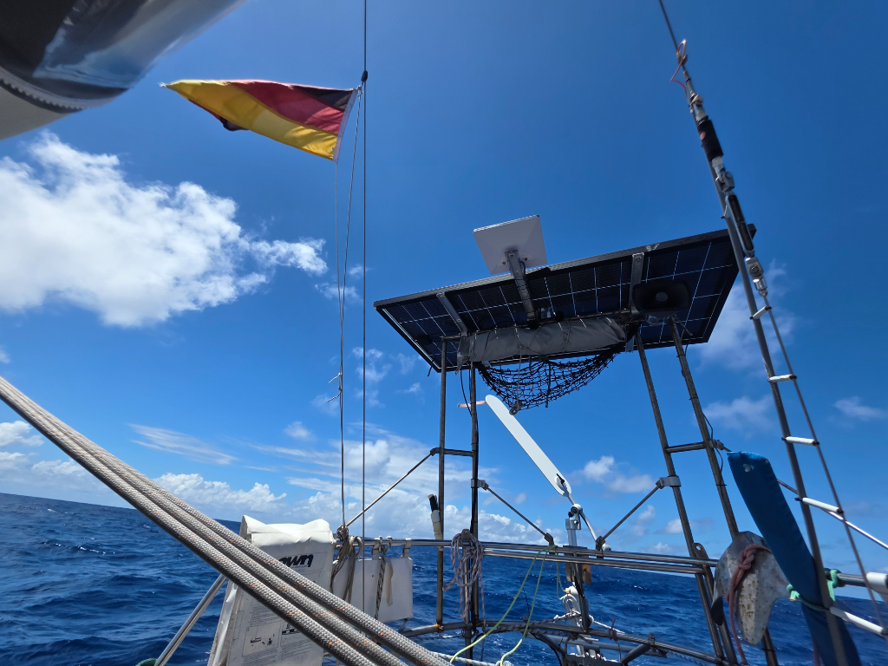

At night the boat was visited by a pod of whales. Large black shapes rose out of the dark sea all around the boat. They stayed for a few minutes, and then continued on their way.

Sailing-wise today has been a rehash of yesterday. Winds are light, just barely enough to keep the three-sail setup filled.

* Distance today: 100NM
* Lunch: paneer coconut curry
* Engine hours: 0
