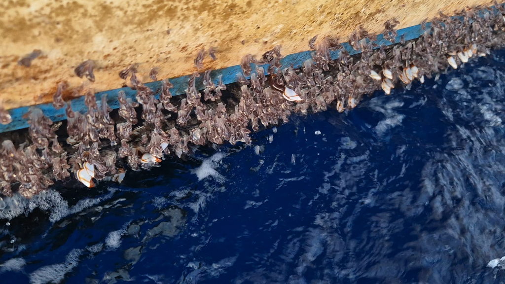
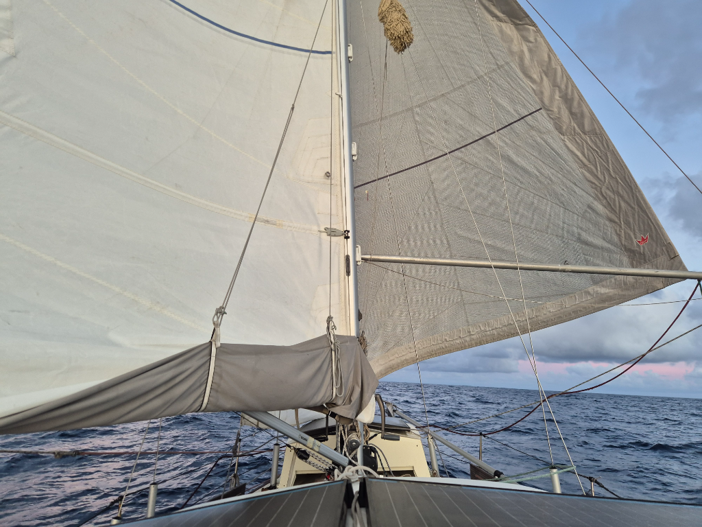

With the evening came a bit more wind, but only for the dark hours without moonlight. The boat bobs gently on, accompanied by periodic bangs from the sails. Not the most pleasant sailing wise. The Pacific isn't pacified. The swell is constant, large and confused. At all times there is at least two swell directions and when they meet at your position, the boat lurches into a random direction. The barnacles are plentiful and their growing size brings the slow speeds even slower.

  

But there is much to celebrate! On this date two years ago we set sail from Berlin towards the cool waters and climate of Scotland. And look at us now! Nearly half way around the world in the tropical heat of the Pacific!

At dawn we gybed as the wind persistently was easterly. On other days we have meandered with the wind shifts, but that option wasn't available today. What a weird sight to see the sails this way around! 

We also moved the ship's time to UTC-9. Only another half hour shift remaining before we are at Marquesas timezone.

* Distance today: 92NM
* Lunch: spaghetti aglio e olio
* Engine hours: 0
