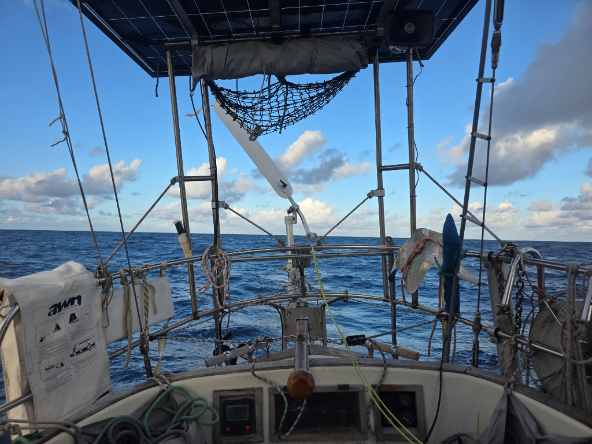

The light winds prevailed through the night. Light enough that we actually let the tillerpilot steer for some time, as there wasn't enough for the windvane.

In the early hours we watched a slow-motion chase scene, as the French sailboat _La Bulle_ approached behind the horizon, and pulled ahead in about 7h from first contact. Boats are getting closer as we all head for the same islands. This was our 16th vessel sighting, and the second sailboat.

Just before dinnertime we gybed again, as now the winds should again carry a southerly component. Under 400NM to go!

* Distance today: 91NM
* Lunch: navy bean soup
* Engine hours: 0
