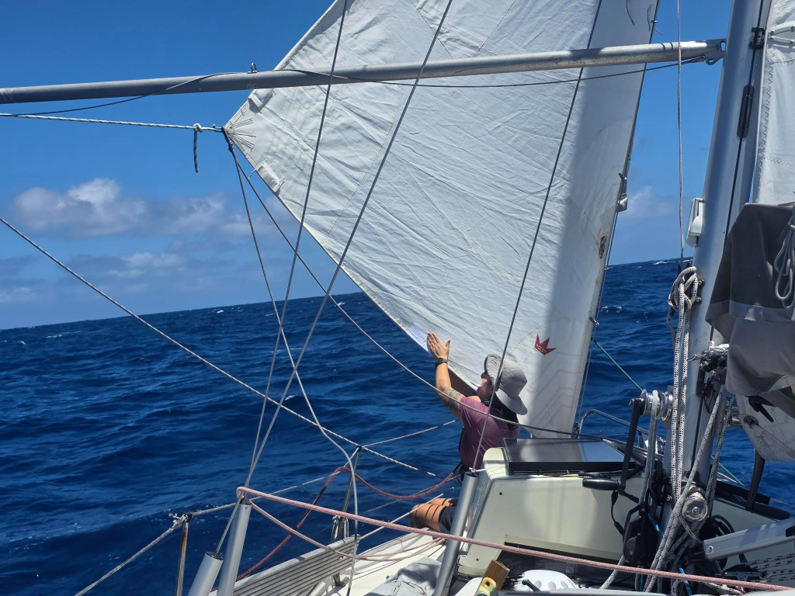

Slightly after watch change, it was time to roll in the genoa and go wing on wing with the staysail. The night came with variable windspeeds littered with occasional squalls and rain. As the sun rose, the skies cleared but the wind stayed. We were moving fast, with the whole barnacle farm. Even the windvane servo rudder is rocking its first few small individuals.
  
The boat starts showing the length of the passage. The sun cover strip of our genoa needs some re-stiching, we moved the windvane steering line by 20cm to move the slightly chafed bit away from the blocks, and our staysail had a little hole in the bottom that we fixed with some sail tape. The pole-out sheet we use with both sails got turned around as there was some significant chafe developing in it where it goes through the eye of the pole. The genoa sheets look like they want to be turned around so that the good end of the line replaces the parts where wear and tear are starting to take their toll. And the sides of the boat - brown with algae growth. Lille Ø will need some TLC after this one.

* Distance today: 108NM
* Lunch: chanterelle risotto
* Engine hours: 0
