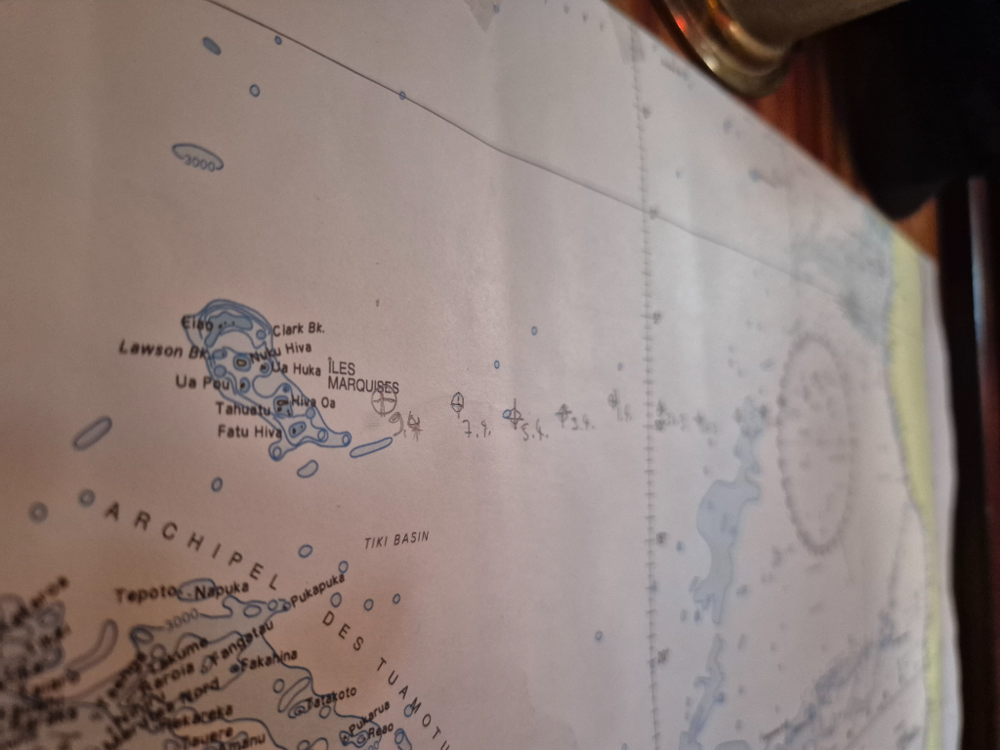

As our target draws nearer, we need to start paying a bit more attention to navigation. It is no longer enough to follow a roughly westerly course whichever way the wind blows. And so, we gybed right after dinner to gain a bit more northing.

The night was a bit lighter than forecasted, but with the easterly wind. Sunrise brought more wind, and from the southeast, and so we gybed again. Now the bow is pointing straight to target.

* Distance today: 100NM
* Lunch: pea soup
* Engine hours: 0
