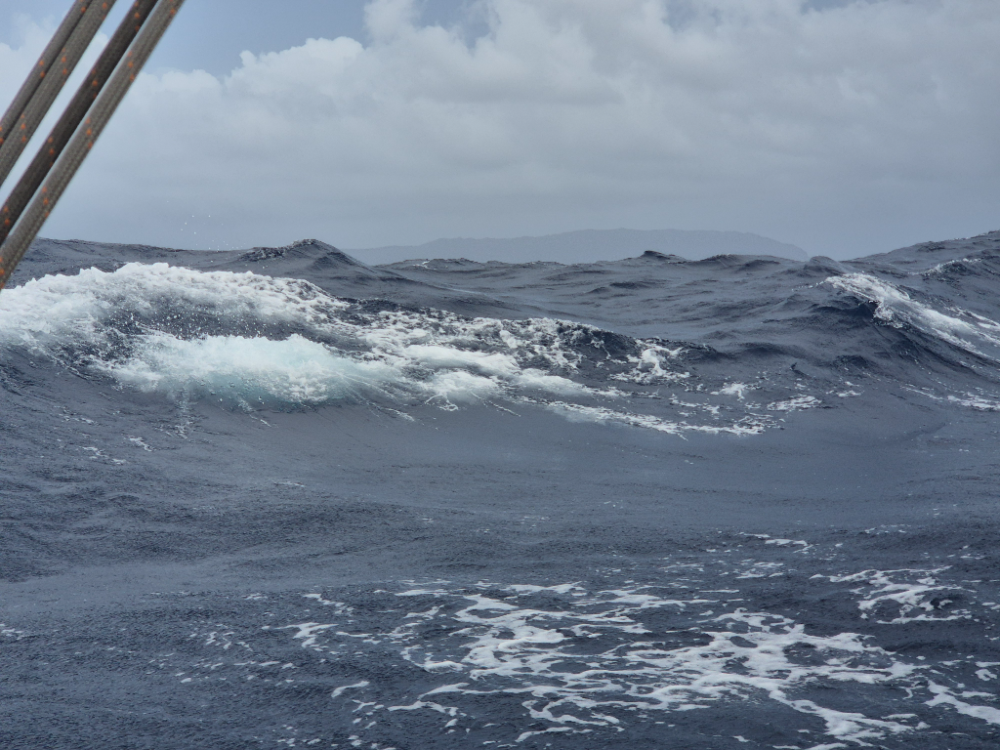
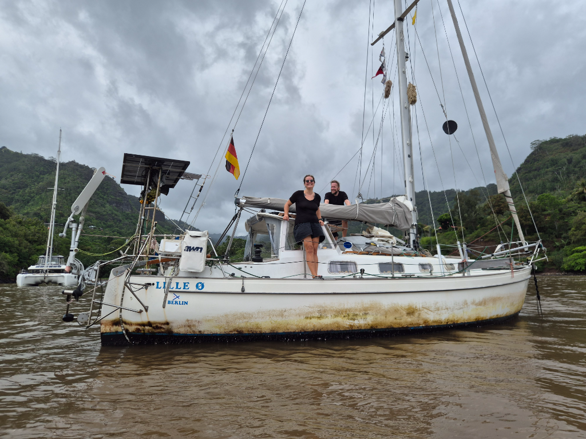

The night was dark and filled with squalls turning the wind. Our track was coming out like an plan for uneven stairs. The wind mostly stayed between 20 and 25kn and Lille Ø was behaving magnificiently even though the waves were tossing us around. Inside even sitting required 3 points of contact to ensure stability. We were fast. Even the barnacles agreed it is go time and streamlined themselves against the hull.

As the sun was slowly rising there hadn't been any sight of land yet. As this promised to be the last day at sea the morning watch got served a cappuccino. Oh what a taste! And as if the caffeine had heightened my senses, soon after land was sighted! A dark shape between the clouds rising from the sea. The eastern most point of Hiva Oa. It seems we can find a needle in a haystack or a tiny island in the vastness of the ocean! 

As the day grew older, more of the islands unveiled themselves from the clouds. The sheer rockfaces reaching up to the sky straight from the ocean. The terrain will be a proper bootcamp for our legs which haven't taken more than a few hundred steps per day for the past 6 weeks!

As we got closer to shore, the wind dwindled but we were enjoying the slower pace that gave us time to take in the schenery. The various greens of the forest covering the island, the numerous birds zig-zagging between the waves in the quest for food and the blacks and browns of the cliffs plunging to the sea.  Then depth sounder sprang alive! 100 meters to the bottom. We had found the foot of the island.

The entrance to the anchorage reveals itsel quite late. Just behind a small peninsula where waves were breaking with thunderous bangs we were greeted with a small swell and brown runoff water from the river. We made our way right to the mouth of the river where someone had left a Lille Ø sized hole. Only 3 meters deep here, but it is enough. Now we are again connected to both land and sea. The great sea voyage is now behind us and we open a new chapter of Pacific island hopping.

* Distance today: 91NM
* Lunch: not yet
* Engine hours: 0.9
