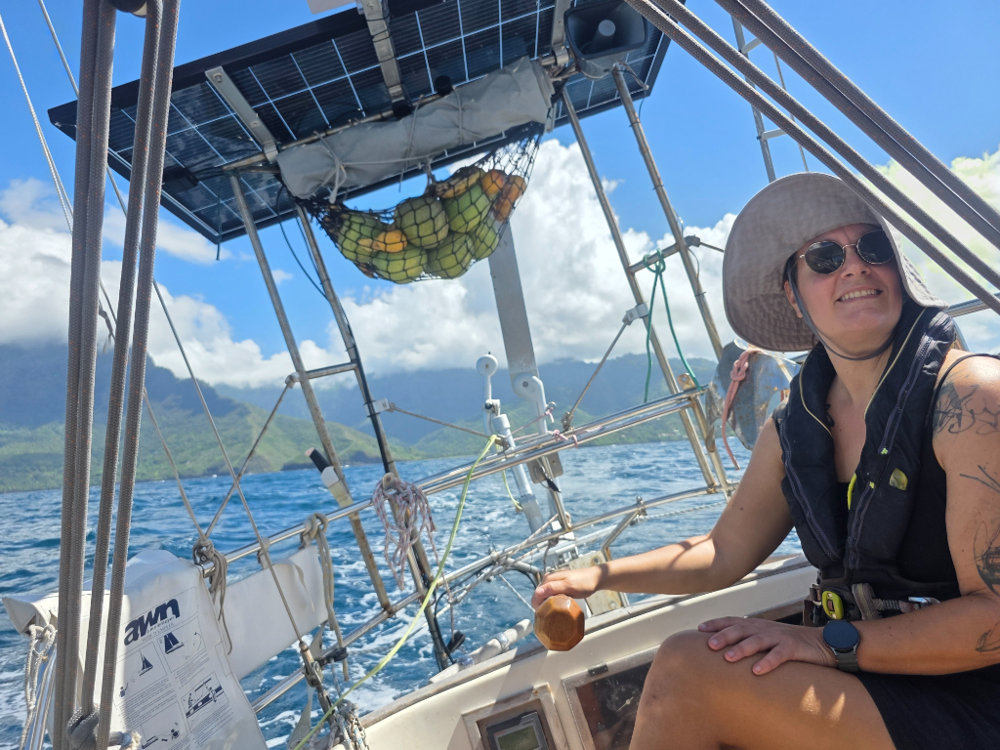

We had a great week exploring Hiva Oa. However, the muddy river water wasn't suitable for swimming or running the watermaker, and so we decided to move over to Tahuata. We still hadn't had a chance to clean the hull, but the local crab population had done a great job eating away most of it.

We hoisted the main into first reef in the shelter of the breakwater, and sailed high into the wind. As the Haava Channel got closer, we could slowly lower the course, eventually to wing on wing.

We arrived to a beautiful bay with a palm beach. The anchorage is quite full, with many boats we know from various stages of our cruise.

* Distance today: 9.4NM
* Lunch: spaghetti with aubergines
* Engine hours: 0.7
