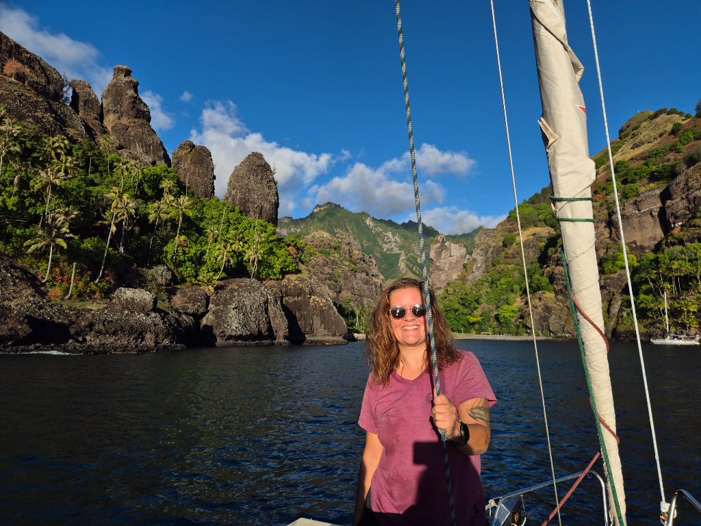

In the darkness we prepped the boat for leaving. Mentally we weren't quite ready but this weather window was too good to pass. Most people arrive to Fatu Hiva after the passage without checking in to avoid the beating to the wind and waves that have the whole Pacific time to build up to arrive to an island they already passed. We being us did it the proper way. But instead of beating we had a nice beam reach sail with minimal swell after we were out of the shadow of Hiva Oa.

This was something you can call champagne sailing! Absolute bliss under full genoa and mainsail.

Anchoring proved to be complicated, as in Hanavave the anchoring spots are either good and deep or bad and shallow. We tried shallow and bad for few times before giving up and opting for good and deep. Now we have the full 50 meters out and for good measure also the rope is on deck in case we need to give more scope. The bottom of the anchor chain locker saw daylight for the first time since Scotland!

* Distance today: 47.8NM
* Lunch: vegetable wrapps
* Engine hours: 3.6
