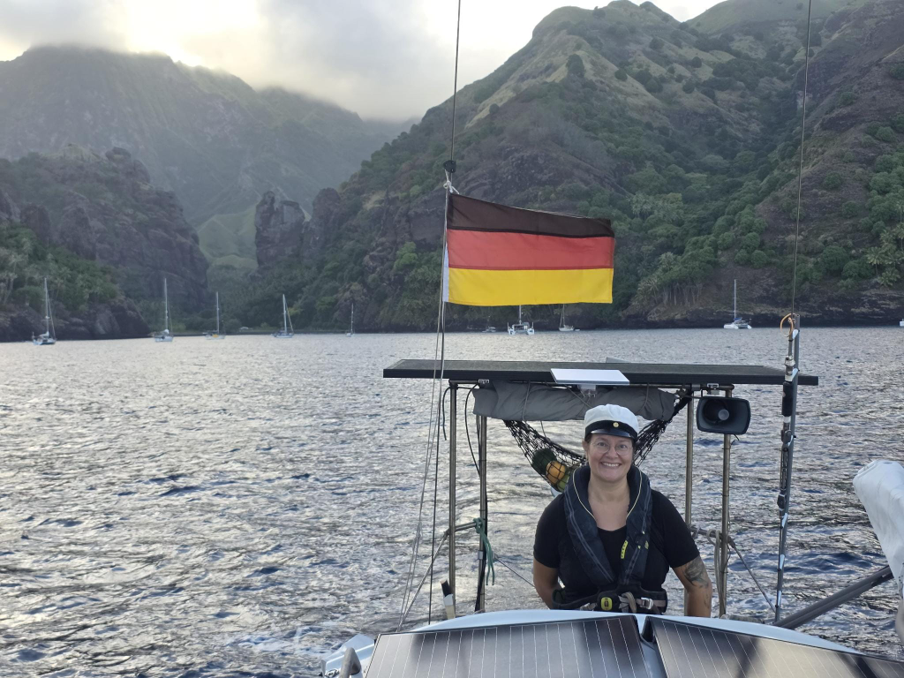
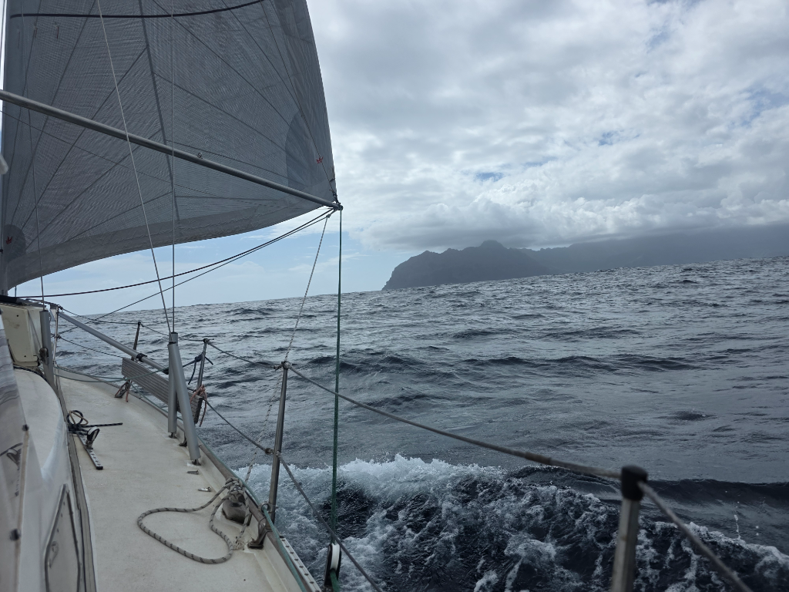

We woke up again before the sunrise to prepare the boat. We packed away the dinghy and replaced the hydrogenerator fastening washer. Then it was time to fight the anchor up. Hoisting anchor by hand from 12m is never easy, but the gale-force katabatics of previous night had truly dug the anchor in. But with enough patience, it came up.

As Havis Amanda had receiced her hat by the time we were underway, Suski also wore her Vappu gear for the sail. Manta rays escorted us out of the bay. Mantas, without a hat.

We hoisted the main in 1st reef and motorsailed until we got out of the wind shadow of Fatu Hiva. Then we unrolled the genoa and continued on a brisk but nice broad reach.

At the south end of Tahuata the conditions got quite gusty. We entered the scenic bay of Hanatefau, but just as we got the hook down, a katabatic wind swept through the anchorage. We saw a dinghy with a large outboard fly up, flip, and fall back into the water. With that, we decided to seek a calmer anchorage. And so we continued to Hanamoenoa. Mantas again escorted us into the bay.

* Distance today: 47.7NM
* Lunch: pomelo
* Engine hours: 3.7
