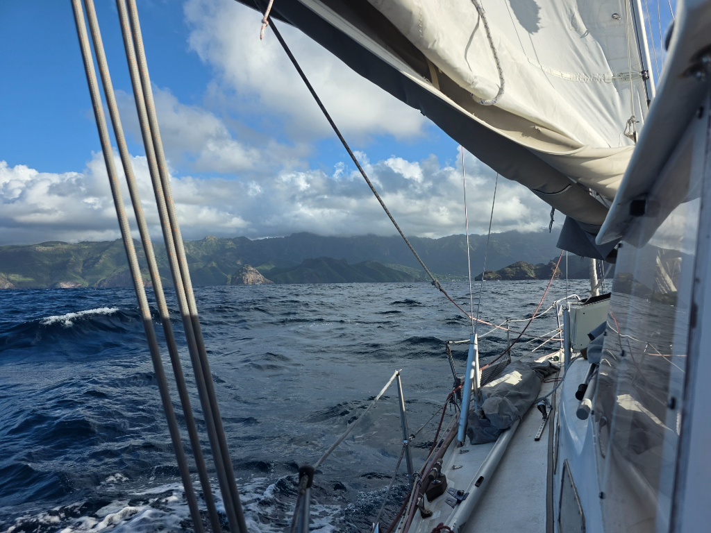

Few hours before sunset we hoisted the anchor and left the beautiful, but crowded anchorage. The distance to Nuku Hiva is enough that you can't do it during the daylight hours, so we opted for a night sail. The sound between Hiva Oa and Tahuata gave us a fllying start. We had dolphins playing in our bow wave untill we reached the windstill behind Hiva Oa. We motored through it and continued under sail power. The sea was lumpy and wing on wing guaranteed we were thoroughly stirred and shaken. 

At sunrise we could see all the leeward islands of Marquesas as we sailed towards our destination, the town of Taiohae. Here we are going to buy groceries before continuing to the more remote anchorages of Nuku Hiva.

* Distance today: 87.6NM
* Lunch: morning coffee
* Engine hours: 2.8
