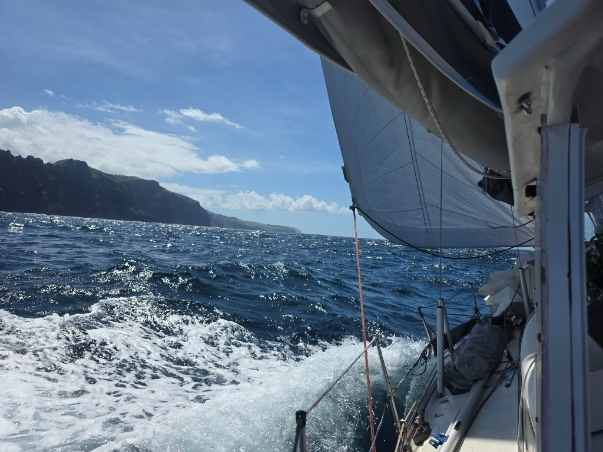

The main bay of Nuku Hiva is convenient for logistics, but quite rolly. So having done our shopping, we decided to seek better anchorages and find *Plan B* again.

Getting past Cape Tikapo required some tacking. Big seas with light winds makes for slow and quite uncomfortable going, especially as we hadn't packed the anchor away.

After passing the cape we could loosen the sheets, and things got more comfortable. We enjoyed a pomelo, and then soon gybed into the protected bay at Anaho. Books have it that this is the best anchorage in the Marquesas. So I think we'll stay a while.

* Distance today: 26.2NM
* Lunch: cashew tomato pasta
* Engine hours: 1.4
